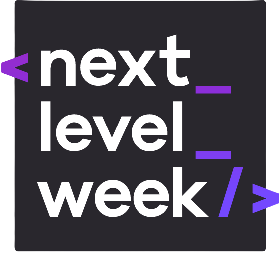

  

<h2 align="center">
Rocketseat
</h2>

Repository with a collection of projects I've mastered and can confidently reproduce, developed during my studies at Rocketseat coding school.

 

## :rocket: Courses repos
Courses taken at Rocketseat. Inside each repo are the projects for that course.

 

 
 
Events projects

 

<!-- 
 
Starter course: HTML, CSS, JavaScript.

   -->

   
  Intermediate course: HTML, CSS, JavaScript, fundamentals of Node.js and React.js.

   

   
   
  Advanced course: React.js, React Native, Node.js, TailwindCSS.
  
   

## :star: Featured Projects

### Level 3 Projects - React
- [Event Platform](https://github.com/diegommagno/rocketseat/tree/main/events/ignite-lab/events-platform)
- [Rocket Notes](https://github.com/diegommagno/rocketseat/tree/main/explorer/stage-09/rocketnotes)

### Level 2 Projects - HTML + CSS + JavaScript

- [AI Movie Suggestions (Using an API)](https://github.com/diegommagno/rocketseat/tree/main/events/boracodar.dev/30-ai-movie-suggestions)
- [RocketPay](https://github.com/diegommagno/rocketseat/tree/main/events/explorer-lab/rocketpay)
- [NLW eSports Explorer](https://github.com/diegommagno/rocketseat/tree/main/events/next-level-week/2022/nlw-esports/explorer)
- [NLW Spacetime Explorer](https://github.com/diegommagno/rocketseat/tree/main/events/next-level-week/2023/nlw-spacetime/explorer)

### Level 1 Projects - HTML + CSS

- [Explore without limits](https://github.com/diegommagno/rocketseat/tree/main/explorer/intensive-stages-01-to-04/)
- [SpaceCream](https://github.com/diegommagno/rocketseat/tree/main/explorer/stage-03/advanced-css/space-cream)
- [Weather Page](https://github.com/diegommagno/rocketseat/tree/main/events/boracodar.dev/10-weather-page/)
- [Pricing Table](https://github.com/diegommagno/rocketseat/tree/main/events/boracodar.dev/15-pricing-table/)
- [Multi Step Form](https://github.com/diegommagno/rocketseat/tree/main/events/boracodar.dev/23-multi-step-form/)
- [Kanban](https://github.com/diegommagno/rocketseat/tree/main/events/boracodar.dev/12-kanban/)
- [Profile Settings](https://github.com/diegommagno/rocketseat/tree/main/events/boracodar.dev/22-profile-settings/)
- [Transport Widget](https://github.com/diegommagno/rocketseat/tree/main/events/boracodar.dev/19-transport-widget/)
- [Forms](https://github.com/diegommagno/rocketseat/tree/main/explorer/stage-03/create-your-event-form)
- [RocketLinks](https://github.com/diegommagno/rocketseat/tree/main/events/explorer-marathon/explorer-marathon-02/rocketlinks)
- [Crystal Ball](https://github.com/diegommagno/rocketseat/tree/main/events/explorer-marathon/explorer-marathon-01/crystal-ball)

## 📘 License

All projects are under the [MIT license](LICENSE.md).
