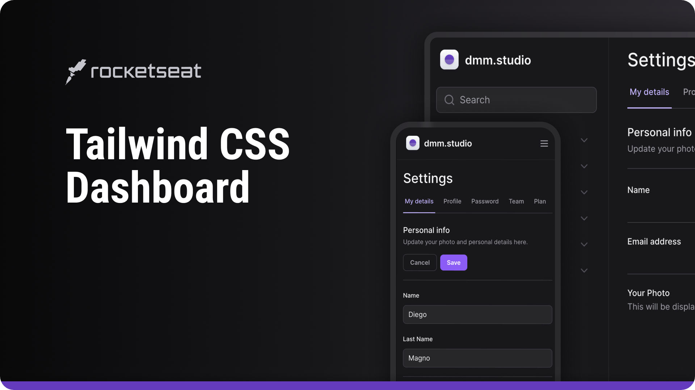

<h1 align="center">NLW Expert Notes</h1>

  <a href="#-live-preview">Live Preview</a>&nbsp;&nbsp;&nbsp;|&nbsp;&nbsp;&nbsp;
  <a href="#-layout">Layout</a>&nbsp;&nbsp;&nbsp;|&nbsp;&nbsp;&nbsp;
  <a href="#-technologies">Technologies</a>&nbsp;&nbsp;&nbsp;|&nbsp;&nbsp;&nbsp;
  <a href="#-worked-on">Worked On</a>

 

  

 

## 📝 Live Preview 

- [NLW Expert Notes](https://nlw-expert-notes-liard-xi.vercel.app/)

 

  
  
  
  
 

## 🎨 Layout

- You can check the layout [here](https://www.figma.com/community/file/1336456128647909148/nlw-expert-notes). You will need a [Figma](https://figma.com) account to access it.

## 🧑🏻‍💻 Technologies

- HTML
- Tailwind CSS
- JavaScript
- Vite
- NodeJS
- Radix UI

## 🎓 Worked on

- Using date-fns
- Used icon pack lucide-react
- Used Sonner to indicate that the note was added
- crypto.randomUUID() to generate a unique string id for every note (used instead of Math.random())
- Tailwind CSS for styling and responsiveness