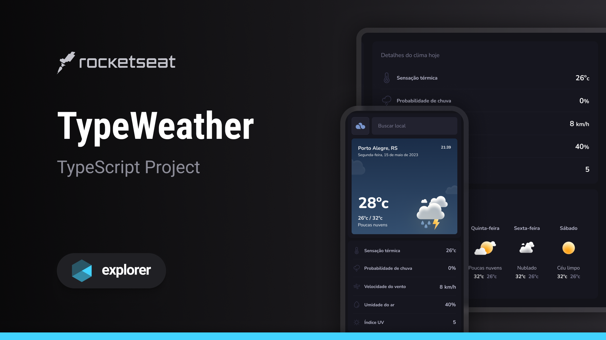

<h1 align="center">TypeWeather</h1>

A weather application UI scaffold designed to explore layout, component structure, and visual patterns before feature implementation

  <a href="#live-preview">Live Preview</a>&nbsp;&nbsp;&nbsp;·&nbsp;&nbsp;&nbsp;
  <a href="#layout">Layout</a>&nbsp;&nbsp;&nbsp;·&nbsp;&nbsp;&nbsp;
  <a href="#technologies">Technologies</a>&nbsp;&nbsp;&nbsp;·&nbsp;&nbsp;&nbsp;
  <a href="#concepts-and-skills">Concepts and Skills</a>

 

  

 

<h3 id="live-preview">🌐 Live Preview</h3>

Access the deployed version of the project.

[TypeWeather](https://nlw-expert-notes-liard-xi.vercel.app/)

 

<!-- 

  

  -->

<h3 id="layout">🎨 Layout</h3>

- View the design layout on [Figma](https://www.figma.com/community/file/1270841135856047223/typeweather).
  A Figma account is required to access the file.

 

<h3 id="technologies">⚙️ Technologies</h3>

- React  
- TypeScript  
- Vite  

 

<h3 id="concepts-and-skills">📚 Concepts and Skills</h3>

- Initial project scaffolding using Vite and React  

- Planned component-based UI architecture  

- Layout exploration based on a predefined design system  

- Preparation for typed state management using TypeScript  

- Focus on visual structure and composition prior to feature development  

 

This project represents an early-stage UI scaffold intended as a foundation for future development rather than a complete application.

