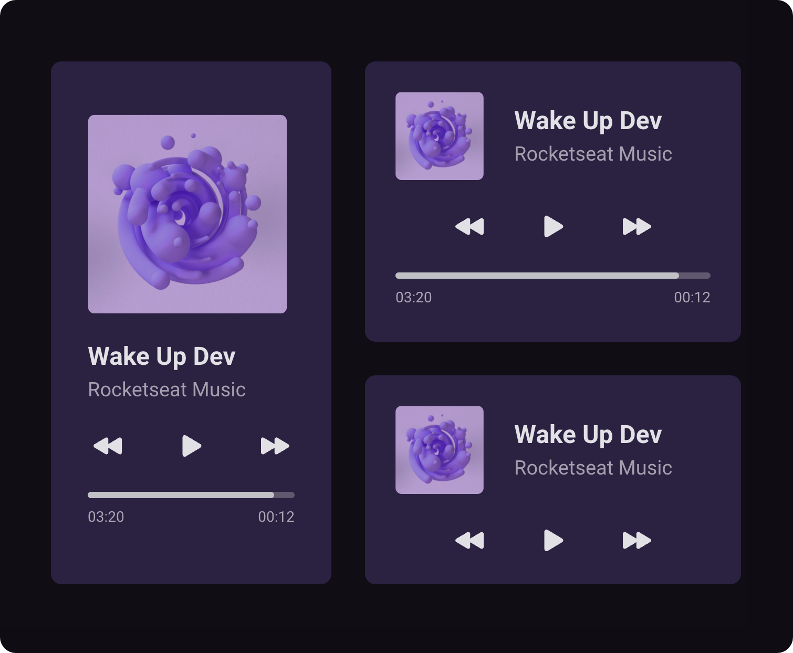

<h1 align="center">Music Player</h1>

A clean music player interface focused on layout composition, typography, and modern CSS techniques

  <a href="#live-preview">Live Preview</a>&nbsp;&nbsp;&nbsp;·&nbsp;&nbsp;&nbsp;
  <a href="#layout">Layout</a>&nbsp;&nbsp;&nbsp;·&nbsp;&nbsp;&nbsp;
  <a href="#technologies">Technologies</a>&nbsp;&nbsp;&nbsp;·&nbsp;&nbsp;&nbsp;
  <a href="#concepts-and-skills">Concepts and Skills</a>

 

  

 

<h3 id="live-preview">🌐 Live Preview</h3>

Access the deployed versions of the project.

- [Music Player — Recreated Version](https://diegommagno.com/github/rocketseat/events/boracodar.dev/01-music-player/)
- [Music Player — Official Challenge Version](https://diegommagno.com/github/rocketseat/events/boracodar.dev/01-music-player/projects/official/)

 

  

 

<h3 id="layout">🎨 Layout</h3>

- View the original challenge layout on [Figma](https://www.figma.com/file/XnielIsj9qrix1qxAQLT9X/23boraCodar-Desafio-1).
  A Figma account is required to access the file.

 

<h3 id="technologies">⚙️ Technologies</h3>

- HTML5
- CSS3
- SCSS

 

<h3 id="concepts-and-skills">📚 Concepts and Skills</h3>

- Semantic HTML structure focused on clarity and readability  

- Base CSS reset and font smoothing for consistent rendering across browsers  

- Use of `rem` units with a normalized root font-size (`62.5%`) for scalable spacing and typography  

- Layout composition using CSS Grid with named grid areas for desktop screens  

- Flexible alignment of UI elements using Flexbox  

- Component-based styling with SCSS nesting for better organization and readability  

- Custom media progress bar built with pseudo-elements (`::before` and `::after`)  

- Responsive behavior with a mobile-first adjustment using media queries  

- Use of modern CSS properties such as `object-fit`, `fit-content`, and logical spacing (`padding-inline`, `padding-block`)

 

This project is part of the <a href="https://boracodar.dev">boracodar.dev</a> weekly challenges.
After completing my own solution, I reviewed the instructor’s approach to explore alternative implementations and improve my understanding of layout and styling strategies.

