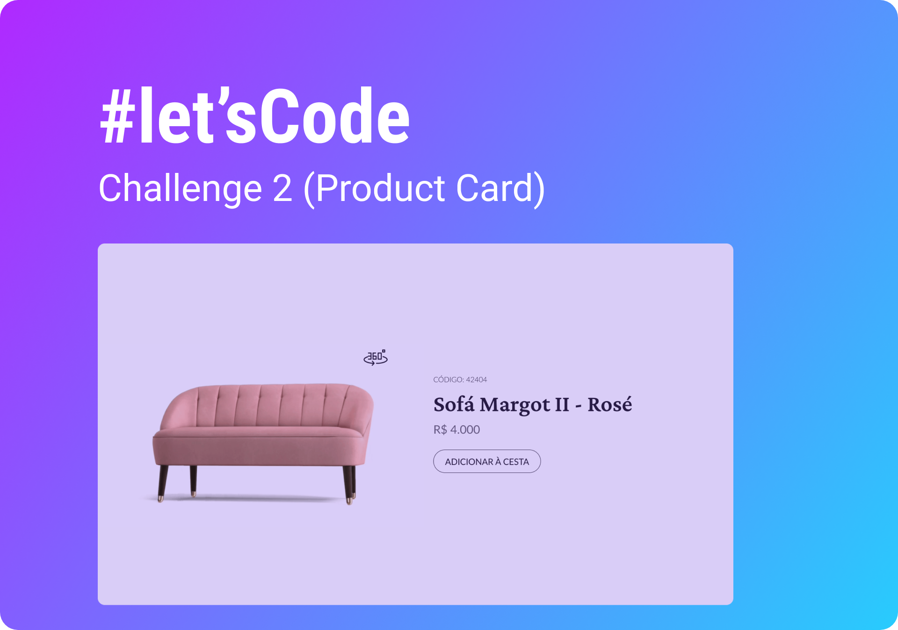

<h1 align="center"> Product Card </h1>

  Introducing a dynamic product card featuring information and an immersive 360° viewing experience.
   
   
  These projects are posted weekly on <a href="https://boracodar.dev">boracodar.dev</a>. 
   
  After completing my own version, I watch the instructor's video to learn alternative approaches and recreate the project.

  <a href="#-live-preview">Live Preview</a>&nbsp;&nbsp;&nbsp;|&nbsp;&nbsp;&nbsp;
  <a href="#-technologies">Technologies</a>&nbsp;&nbsp;&nbsp;|&nbsp;&nbsp;&nbsp;
  <a href="#-layout">Layout</a>&nbsp;&nbsp;&nbsp;|&nbsp;&nbsp;&nbsp;
  <a href="#-worked-on">Worked On</a>

  

  

 

## 📝 Live Preview 

- [Product Card](https://dmm.studio/github/rocketseat/events/boracodar.dev/02-product-card)
- [Product Card - Recreated version](https://dmm.studio/github/rocketseat/events/boracodar.dev/02-product-card/projects/official/)

 

## 🎨 Layout

- You can check the layout [here](https://www.figma.com/community/file/1195050984449538256). You will need a [Figma](https://figma.com) account to access it.

  

 

## 🧑🏻‍💻 Technologies

- HTML
- CSS
- JavaScript

## 🎓 Worked on

- addEventListener
- Flex box