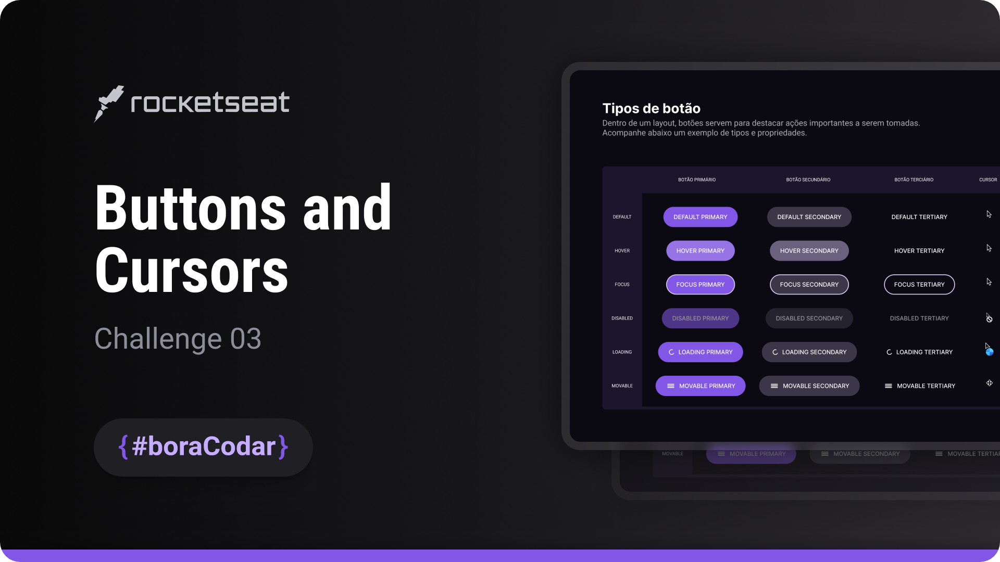

<h1 align="center">Buttons and Cursors</h1>

A UI-focused project exploring button styles, cursor behaviors, and interaction states to improve usability and user feedback through modern CSS and JavaScript techniques

  <a href="#live-preview">Live Preview</a>&nbsp;&nbsp;&nbsp;·&nbsp;&nbsp;&nbsp;
  <a href="#layout">Layout</a>&nbsp;&nbsp;&nbsp;·&nbsp;&nbsp;&nbsp;
  <a href="#technologies">Technologies</a>&nbsp;&nbsp;&nbsp;·&nbsp;&nbsp;&nbsp;
  <a href="#concepts-and-skills">Concepts and Skills</a>

 

  

 

<h3 id="live-preview">🌐 Live Preview</h3>

Access the deployed version of the project.

[Buttons and Cursors — Recreated Version](https://diegommagno.com/github/rocketseat/events/boracodar.dev/03-buttons-and-cursors/)

 

  

 

<h3 id="layout">🎨 Layout</h3>

- View the original challenge layout [here](https://www.figma.com/community/file/1197534710257750520).

 

<h3 id="technologies">⚙️ Technologies</h3>

- HTML5
- CSS3
- SCSS
- JavaScript (ES6+)

 

<h3 id="concepts-and-skills">📚 Concepts and Skills</h3>

- Global CSS reset with font smoothing for consistent rendering across browsers  

- Use of `rem` units with a normalized root font-size (`62.5%`) for scalable spacing and typography  

- Centered layout using CSS Grid (`display: grid` + `place-items: center`) for clean viewport alignment  

- Button variants using CSS Custom Properties (e.g. `--bg-default`, `--bg-hover`) to create a reusable styling system  

- Interactive button states with pseudo-classes (`:hover`, `:focus`, `:disabled`) focused on accessibility and clear user feedback  

- Cursor feedback for different UI states (`pointer`, `progress`, `move`, `not-allowed`) to reinforce interaction context  

- Loading animation using `@keyframes` and `transform: rotate()` applied to an inline icon  

- JavaScript event handling with state toggling to switch classes (`.loading`, `.movable`) and update UI dynamically  

- Dynamic content updates via `innerHTML` to inject icons and preserve button labels during state changes  

 

This project is part of the <a href="https://boracodar.dev">boracodar.dev</a> weekly challenges.
It focuses on improving interaction patterns and visual feedback through buttons and cursor-based UI elements.

