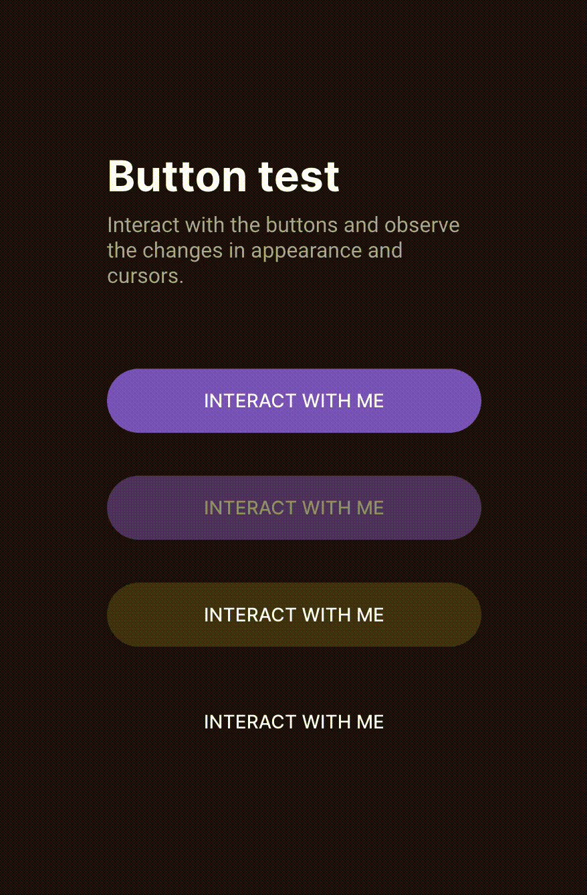

<h1 align="center"> Buttons and Cursors </h1>

Different kinds of buttons and cursors available.  

  <a href="#-live-preview">Live Preview</a>&nbsp;&nbsp;&nbsp;|&nbsp;&nbsp;&nbsp;
  <a href="#-layout">Layout</a>&nbsp;&nbsp;&nbsp;|&nbsp;&nbsp;&nbsp;
  <a href="#-technologies">Technologies</a>&nbsp;&nbsp;&nbsp;|&nbsp;&nbsp;&nbsp;
  <a href="#-worked-on">Worked On</a>

 

  

 

## 📝 Live Preview 

- [Link](https://diegommagno.com/github/rocketseat/events/boracover.dev/03-buttons-and-cursors)

## 🎨 Layout

- You can check the layout [here](https://www.figma.com/community/file/1197534710257750520). You will need a [Figma](https://figma.com) account to access it.

## 🧑🏻‍💻 Technologies

- HTML
- JavaScript
- SCSS

## 🎓 Worked on

- Button states: `::hover`, `::focus`, `::disabled`, `.loading`, `.movable`
- CSS: `flex and grid`, `padding-inline`, `padding-block`, `@keyframes`