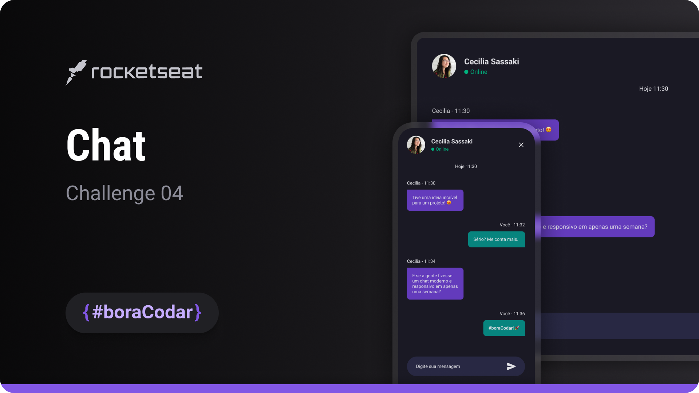
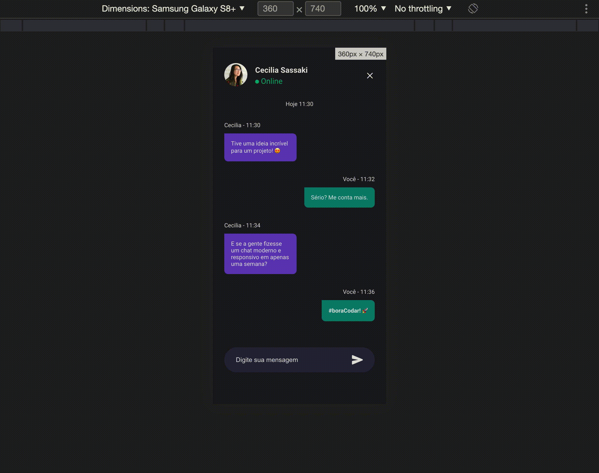

<h1 align="center">Chat</h1>

A clean and responsive chat interface layout focused on UI structure, spacing, and visual interaction patterns using modern HTML and SCSS

  <a href="#live-preview">Live Preview</a>&nbsp;&nbsp;&nbsp;·&nbsp;&nbsp;&nbsp;
  <a href="#layout">Layout</a>&nbsp;&nbsp;&nbsp;·&nbsp;&nbsp;&nbsp;
  <a href="#technologies">Technologies</a>&nbsp;&nbsp;&nbsp;·&nbsp;&nbsp;&nbsp;
  <a href="#concepts-and-skills">Concepts and Skills</a>

 

  

 

<h3 id="live-preview">🌐 Live Preview</h3>

Access the deployed versions of the project.

- [Chat — Recreated Version](https://diegommagno.com/github/rocketseat/events/boracodar.dev/04-chat/)
- [Chat — Official Challenge Version](https://diegommagno.com/github/rocketseat/events/boracodar.dev/04-chat/projects/official/)

 

  

 

<h3 id="layout">🎨 Layout</h3>

- View the original challenge layout on [Figma](https://www.figma.com/community/file/1200070743637495660).
  A Figma account is required to access the file.

 

<h3 id="technologies">⚙️ Technologies</h3>

- HTML5
- CSS3
- SCSS

 

<h3 id="concepts-and-skills">📚 Concepts and Skills</h3>

- Semantic HTML structure to separate header, message list, and input areas clearly  

- Scalable layout composition using Flexbox for vertical and horizontal alignment  

- Normalized spacing and typography using `rem` units and CSS custom properties  

- Visual state handling with `:focus-within` to improve input interaction feedback  

- Conditional styling using pseudo-classes such as `:not()` for UI state control  

- Message alignment and growth control using flexible sizing (`flex: 1`)  

- Background layering and visual separation between chat areas  

- Decorative and structural elements implemented with pseudo-elements (`::before`)  

- Responsive adjustments via media queries to support different screen sizes  

 

This project is part of the <a href="https://boracodar.dev">boracodar.dev</a> weekly challenges.
It focuses on structuring a chat UI layout with responsive behavior and clear visual hierarchy using only HTML and SCSS.

