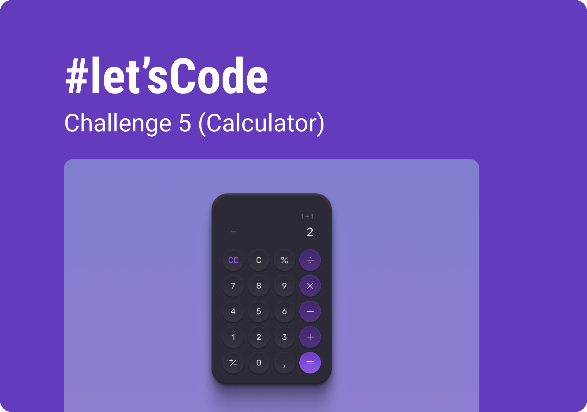

<h1 align="center"> Calculator </h1>

  Functional calculator with clean design.
   
   
  These projects are posted weekly on <a href="https://boracodar.dev">boracodar.dev</a>. 
   
  After completing my own version, I watch the instructor's video to learn alternative approaches and recreate the project.

  <a href="#-live-preview">Live Preview</a>&nbsp;&nbsp;&nbsp;|&nbsp;&nbsp;&nbsp;
  <a href="#-layout">Layout</a>&nbsp;&nbsp;&nbsp;|&nbsp;&nbsp;&nbsp;
  <a href="#-technologies">Technologies</a>&nbsp;&nbsp;&nbsp;|&nbsp;&nbsp;&nbsp;
  <a href="#-worked-on">Worked On</a>

 

  

 

## 📝 Live Preview 

- [Calculator](https://diegommagno.com/github/rocketseat/events/boracodar.dev/05-calculator/)

 

  

 

## 🎨 Layout

- You can check the layout [here](https://www.figma.com/community/file/1202607074523509182/%23boraCodar---Desafio-5). You will need a [Figma](https://figma.com) account to access it.

## 🧑🏻‍💻 Technologies

- HTML
- SCSS

## 🎓 Worked on

- CSS: `flex`, `rem`, `background`, `media`, `variables` 