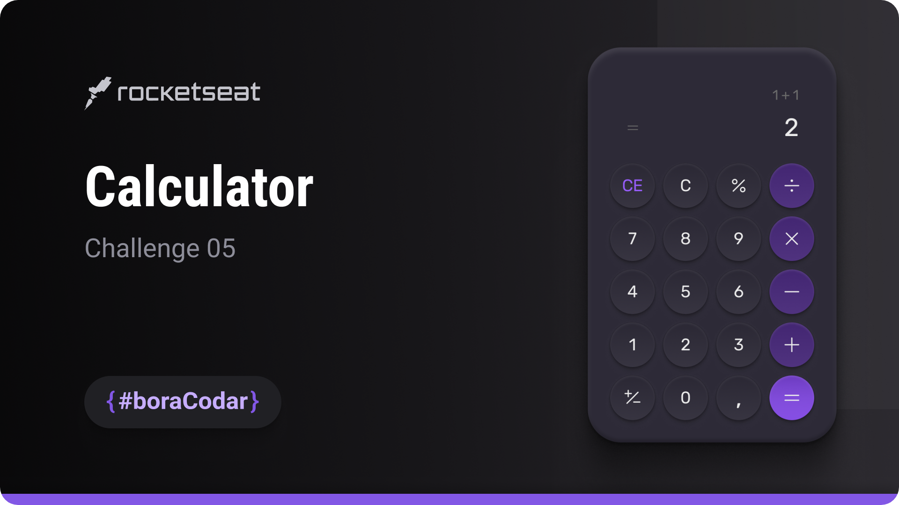
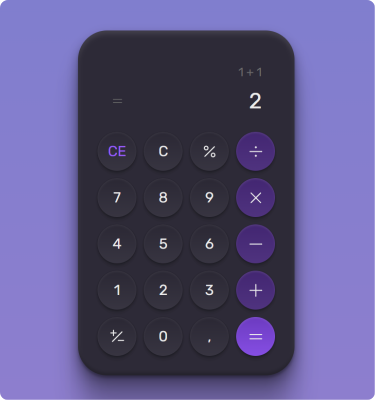

<h1 align="center">Calculator</h1>

A clean and visually focused calculator interface designed with emphasis on layout structure, spacing, and modern CSS styling techniques

  <a href="#live-preview">Live Preview</a>&nbsp;&nbsp;&nbsp;·&nbsp;&nbsp;&nbsp;
  <a href="#layout">Layout</a>&nbsp;&nbsp;&nbsp;·&nbsp;&nbsp;&nbsp;
  <a href="#technologies">Technologies</a>&nbsp;&nbsp;&nbsp;·&nbsp;&nbsp;&nbsp;
  <a href="#concepts-and-skills">Concepts and Skills</a>

 

  

 

<h3 id="live-preview">🌐 Live Preview</h3>

Access the deployed version of the project.

[Calculator — Recreated Version](https://diegommagno.com/github/rocketseat/events/boracodar.dev/05-calculator/projects/official/)

 

  

 

<h3 id="layout">🎨 Layout</h3>

- View the original challenge layout [here](https://www.figma.com/community/file/1202607074523509182/%23boraCodar---Desafio-5).

 

<h3 id="technologies">⚙️ Technologies</h3>

- HTML5
- CSS3
- SCSS

 

<h3 id="concepts-and-skills">📚 Concepts and Skills</h3>

- Semantic HTML structure to organize calculator display and control sections  

- Layout composition using CSS Grid for precise button alignment and spacing  

- Flexible container alignment with Flexbox for overall layout structure  

- Scalable sizing and typography using `rem` units  

- Visual depth and hierarchy created with `box-shadow` and `inset` effects  

- Use of CSS custom properties for consistent theming and color management  

- Gradient backgrounds implemented with `linear-gradient` for modern UI styling  

- Responsive behavior handled via media queries  

- Reusable grid patterns using `grid-template-columns: repeat()`  

 

This project is part of the <a href="https://boracodar.dev">boracodar.dev</a> weekly challenges.
It focuses on building a visually polished calculator UI using modern layout and styling techniques with HTML and SCSS.

