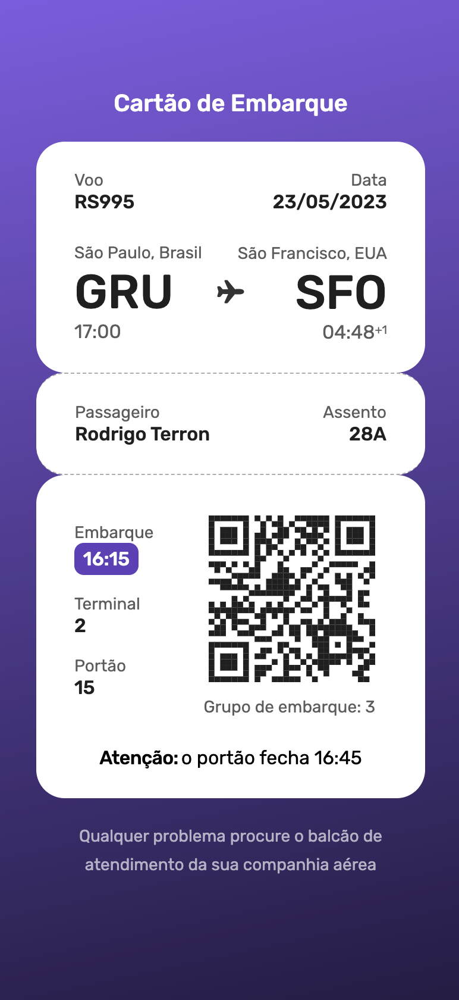

<h1 align="center"> Boarding Pass </h1>

Boarding pass example made with HTML and CSS.  

  <a href="#-live-preview">Live Preview</a>&nbsp;&nbsp;&nbsp;|&nbsp;&nbsp;&nbsp;
  <a href="#-layout">Layout</a>&nbsp;&nbsp;&nbsp;|&nbsp;&nbsp;&nbsp;
  <a href="#-technologies">Technologies</a>&nbsp;&nbsp;&nbsp;|&nbsp;&nbsp;&nbsp;
  <a href="#-worked-on">Worked On</a>

  

  

 

## 📝 Live Preview 

- [Brazilian Portuguese](https://diegommagno.com/github/rocketseat/events/devlinks/)

## 🎨 Layout
Check the [project layout](https://www.figma.com/community/file/1205146101173113980) on Figma. 

## 🧑🏻‍💻 Technologies

- HTML
- CSS
- JavaScript

## 🎓 Worked on

- setAttribute()
- Switching themes