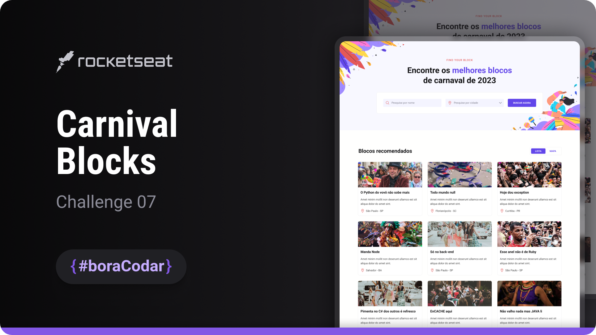

<h1 align="center">Carnival Blocks</h1>

A UI-focused page showcasing recommended carnival blocks with filtering controls and structured content presentation

  <a href="#live-preview">Live Preview</a>&nbsp;&nbsp;&nbsp;·&nbsp;&nbsp;&nbsp;
  <a href="#layout">Layout</a>&nbsp;&nbsp;&nbsp;·&nbsp;&nbsp;&nbsp;
  <a href="#technologies">Technologies</a>&nbsp;&nbsp;&nbsp;·&nbsp;&nbsp;&nbsp;
  <a href="#concepts-and-skills">Concepts and Skills</a>

 

  

 

<h3 id="live-preview">🌐 Live Preview</h3>

Access the deployed version of the project.

[Carnival Blocks — Recreated Version](https://diegommagno.com/github/rocketseat/events/boracodar.dev/07-bloco-de-carnaval/)

 

<h3 id="layout">🎨 Layout</h3>

- View the original challenge layout [here](https://www.figma.com/community/file/1207675804423978995).

 

<h3 id="technologies">⚙️ Technologies</h3>

- HTML5
- CSS3
- SCSS
- Figma
- Phosphor Icons

 

<h3 id="concepts-and-skills">📚 Concepts and Skills</h3>

- Semantic HTML structure using `header`, `main`, `section`, and form elements for clear content organization  

- Custom form controls including input, select, and button components styled for visual consistency  

- Layout composition using Flexbox and CSS Grid to organize filters and content cards  

- Scalable spacing and typography using `rem` units  

- Visual layering and decoration implemented with pseudo-elements (`::before`, `::after`)  

- Positioning strategies using relative and absolute positioning with `fit-content`  

- Responsive behavior handled via media queries for different screen sizes  

- Integration of custom fonts and iconography using Phosphor Icons  

- UI overflow and visibility control to maintain layout integrity  

 

This project is part of the <a href="https://boracodar.dev">boracodar.dev</a> weekly challenges.
It focuses on building a filterable UI layout with reusable components and responsive behavior using HTML and SCSS.

