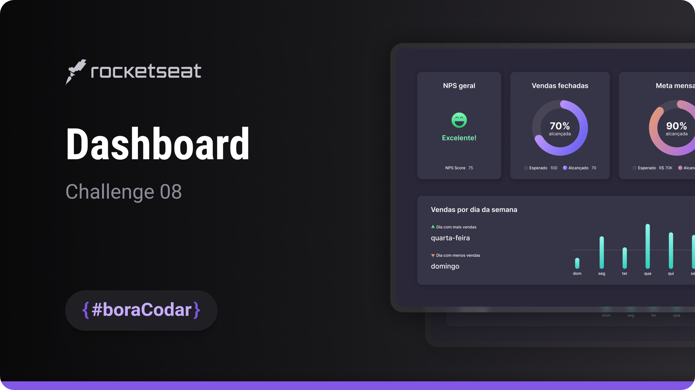

<h1 align="center">Dashboard</h1>

A dashboard interface designed for visualizing metrics with clear layout structure and data-focused UI composition

  <a href="#live-preview">Live Preview</a>&nbsp;&nbsp;&nbsp;·&nbsp;&nbsp;&nbsp;
  <a href="#layout">Layout</a>&nbsp;&nbsp;&nbsp;·&nbsp;&nbsp;&nbsp;
  <a href="#technologies">Technologies</a>&nbsp;&nbsp;&nbsp;·&nbsp;&nbsp;&nbsp;
  <a href="#concepts-and-skills">Concepts and Skills</a>

 

  

 

<h3 id="live-preview">🌐 Live Preview</h3>

Access the deployed version of the project.

[Dashboard — Recreated Version](https://diegommagno.com/github/rocketseat/events/boracodar.dev/08-dashboard/)

 

<!-- 

  

 -->

 

<h3 id="layout">🎨 Layout</h3>

- View the original challenge layout on [Figma](https://www.figma.com/community/file/1210217615683203825).
  A Figma account is required to access the file.

 

<h3 id="technologies">⚙️ Technologies</h3>

- HTML5
- CSS3
- SCSS

 

<h3 id="concepts-and-skills">📚 Concepts and Skills</h3>

- Semantic HTML structure to organize dashboard sections and metric components  

- Layout composition using Flexbox to align cards and content blocks  

- Scalable spacing and typography using `rem` units  

- Use of CSS custom properties for consistent theming and color management  

- Visual hierarchy and grouping to improve metric readability  

- Responsive layout adjustments to support different screen sizes  

 

This project is part of the <a href="https://boracodar.dev">boracodar.dev</a> weekly challenges.
It focuses on building a metrics-oriented dashboard layout with clear visual hierarchy using HTML and SCSS.

