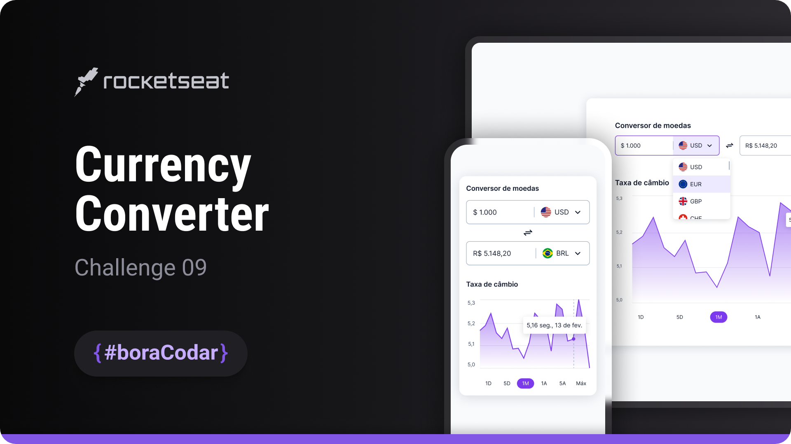

<h1 align="center">Currency Converter</h1>

A base UI component for a currency converter, designed to display exchange-related information and serve as a foundation for future functionality

  <a href="#live-preview">Live Preview</a>&nbsp;&nbsp;&nbsp;·&nbsp;&nbsp;&nbsp;
  <a href="#layout">Layout</a>&nbsp;&nbsp;&nbsp;·&nbsp;&nbsp;&nbsp;
  <a href="#technologies">Technologies</a>&nbsp;&nbsp;&nbsp;·&nbsp;&nbsp;&nbsp;
  <a href="#concepts-and-skills">Concepts and Skills</a>

 

  

 

<h3 id="live-preview">🌐 Live Preview</h3>

Access the deployed base version of the project.

[Currency Converter — Base Layout](https://diegommagno.com/github/rocketseat/events/boracodar.dev/09-currency-converter/)

 

<!-- 

  

 -->

 

<h3 id="layout">🎨 Layout</h3>

- View the original challenge layout [here](https://www.figma.com/community/file/1212757179376046656).

 

<h3 id="technologies">⚙️ Technologies</h3>

- HTML5
- CSS3
- SCSS

 

<h3 id="concepts-and-skills">📚 Concepts and Skills</h3>

- Semantic HTML structure focused on building a reusable component layout  

- Base layout composition using Flexbox for alignment and spacing  

- Scalable sizing and typography using `rem` units  

- Use of CSS custom properties for consistent styling and theming  

- Responsive structure prepared for future functional enhancements  

 

This project is part of the <a href="https://boracodar.dev">boracodar.dev</a> weekly challenges.
It currently represents the base UI structure for a currency converter, prepared to receive logic and data integration in future iterations.

