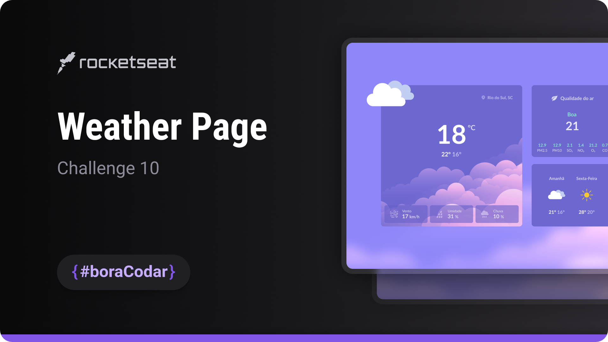
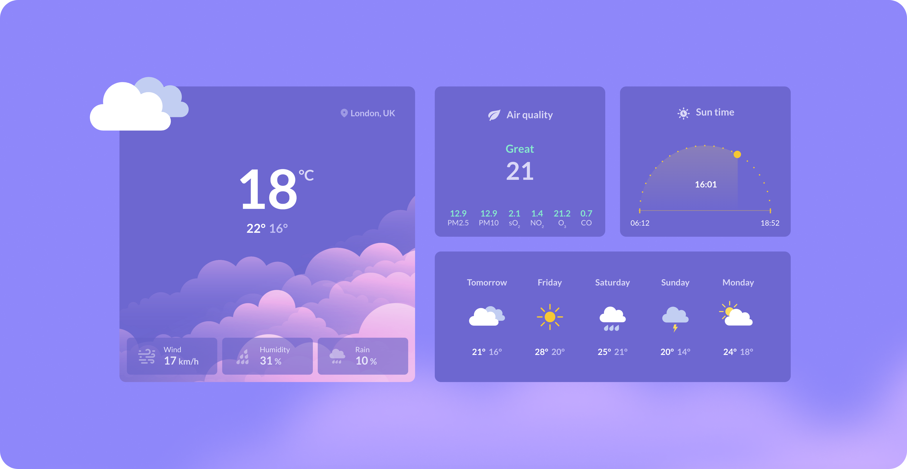

<h1 align="center">Weather Page</h1>

A weather interface layout focused on visual hierarchy, data presentation, and responsive UI composition using HTML and SCSS

  <a href="#live-preview">Live Preview</a>&nbsp;&nbsp;&nbsp;·&nbsp;&nbsp;&nbsp;
  <a href="#layout">Layout</a>&nbsp;&nbsp;&nbsp;·&nbsp;&nbsp;&nbsp;
  <a href="#technologies">Technologies</a>&nbsp;&nbsp;&nbsp;·&nbsp;&nbsp;&nbsp;
  <a href="#concepts-and-skills">Concepts and Skills</a>

 

  

 

<h3 id="live-preview">🌐 Live Preview</h3>

Access the deployed version of the project.

[Weather Page — Recreated Version](https://diegommagno.com/github/rocketseat/events/boracodar.dev/10-weather-page)

 

  

 

<h3 id="layout">🎨 Layout</h3>

- View the original challenge layout on [Figma](https://www.figma.com/community/file/1215291914714743267).
  A Figma account is required to access the file.

 

<h3 id="technologies">⚙️ Technologies</h3>

- HTML5
- CSS3
- SCSS

 

<h3 id="concepts-and-skills">📚 Concepts and Skills</h3>

- Semantic HTML structure to organize weather data sections such as current conditions, air quality, sun time, and weekly forecast  

- Component-based layout composition separating temperature, statistics, and forecast blocks  

- Use of Flexbox to align icons, labels, and numeric values consistently  

- Scalable spacing and typography using `rem` units  

- Visual hierarchy to emphasize primary data such as current temperature and location  

- Reusable UI patterns for statistic blocks and daily forecast items  

- Integration of iconography and imagery to support data interpretation  

- Responsive layout prepared for different screen sizes  

 

This project is part of the <a href="https://boracodar.dev">boracodar.dev</a> weekly challenges.
It focuses on building a weather UI layout with structured data presentation and responsive design using HTML and SCSS.

