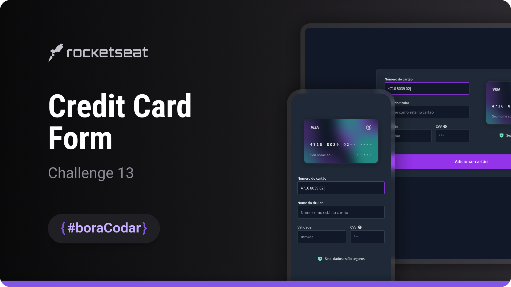

<h1 align="center">Credit Card Form</h1>

A credit card form UI component focused on visual structure, input layout, and realistic card representation for web and mobile interfaces

  <a href="#live-preview">Live Preview</a>&nbsp;&nbsp;&nbsp;·&nbsp;&nbsp;&nbsp;
  <a href="#layout">Layout</a>&nbsp;&nbsp;&nbsp;·&nbsp;&nbsp;&nbsp;
  <a href="#technologies">Technologies</a>&nbsp;&nbsp;&nbsp;·&nbsp;&nbsp;&nbsp;
  <a href="#concepts-and-skills">Concepts and Skills</a>

 

  

 

<h3 id="live-preview">🌐 Live Preview</h3>

Access the deployed version of the project.

[Credit Card Form — Recreated Version](https://diegommagno.com/github/rocketseat/events/boracodar.dev/13-credit-card-form)

 

<!-- 

  

 -->

 

<h3 id="layout">🎨 Layout</h3>

- View the original challenge layout [here](https://www.figma.com/community/file/1222904930776225825).

 

<h3 id="technologies">⚙️ Technologies</h3>

- HTML5
- CSS3
- SCSS

 

<h3 id="concepts-and-skills">📚 Concepts and Skills</h3>

- Semantic HTML structure for form fields and credit card information  

- Input layout organization using Flexbox for consistent spacing and alignment  

- Scalable spacing and typography using `rem` units  

- Use of CSS custom properties for consistent theming and styling control  

- Realistic card visualization using 3D perspective (`perspective`)  

- Layered positioning techniques with relative and absolute positioning  

- Inheritance-based styling to maintain visual consistency across form elements  

- Responsive layout prepared for different screen sizes  

 

This project is part of the <a href="https://boracodar.dev">boracodar.dev</a> weekly challenges.
It focuses on building a visually rich credit card form component with attention to layout, depth, and UI realism using HTML and SCSS.

