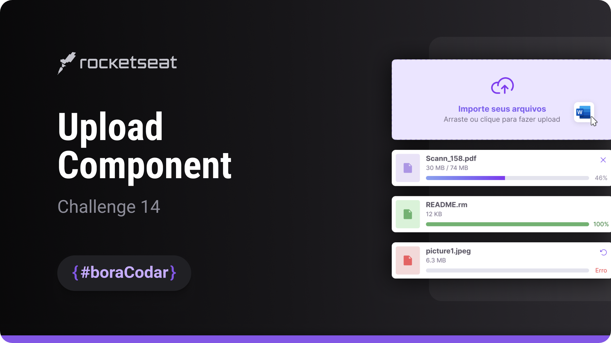
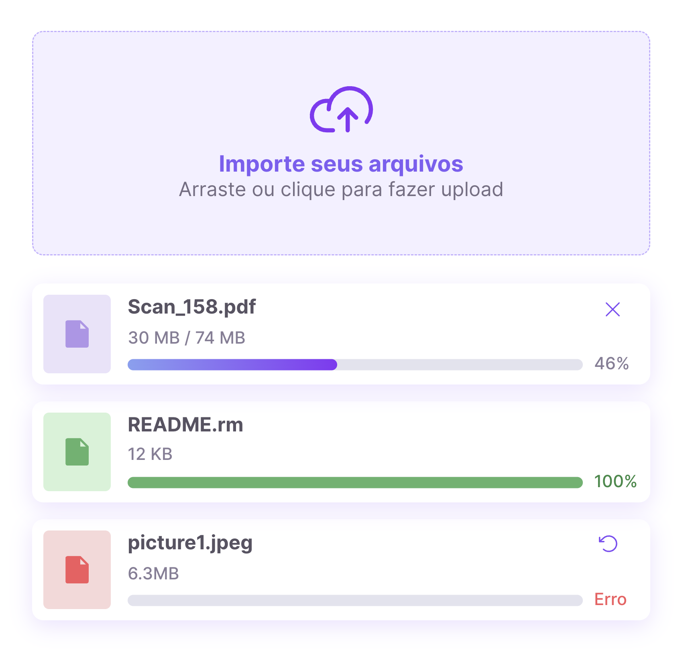

<h1 align="center">Upload Component</h1>

A file upload UI component focused on layout structure, visual feedback, and reusable styling for web and mobile interfaces

  <a href="#live-preview">Live Preview</a>&nbsp;&nbsp;&nbsp;·&nbsp;&nbsp;&nbsp;
  <a href="#layout">Layout</a>&nbsp;&nbsp;&nbsp;·&nbsp;&nbsp;&nbsp;
  <a href="#technologies">Technologies</a>&nbsp;&nbsp;&nbsp;·&nbsp;&nbsp;&nbsp;
  <a href="#concepts-and-skills">Concepts and Skills</a>

 

  

 

<h3 id="live-preview">🌐 Live Preview</h3>

Access the deployed version of the project.

[Upload Component — Recreated Version](https://diegommagno.com/github/rocketseat/events/boracodar.dev/14-upload-component)

 

  

 

<h3 id="layout">🎨 Layout</h3>

- View the original challenge layout on [Figma](https://www.figma.com/community/file/1225440656930547927).
  A Figma account is required to access the file.

 

<h3 id="technologies">⚙️ Technologies</h3>

- HTML5
- CSS3
- SCSS

 

<h3 id="concepts-and-skills">📚 Concepts and Skills</h3>

- Semantic HTML structure for upload areas and file-related UI elements  

- Layout composition using Flexbox and CSS Grid for alignment and spacing  

- Scalable sizing and typography using `rem` units  

- Styling variations using structural selectors such as `:nth-child()`  

- Visual customization of SVG icons through CSS for state-based feedback  

- Positioning techniques with relative and absolute positioning  

- Reusable component styling prepared for integration into larger applications  

 

This project is part of the <a href="https://boracodar.dev">boracodar.dev</a> weekly challenges.
It focuses on building a reusable upload UI component with clear structure and adaptable styling using HTML and SCSS.

