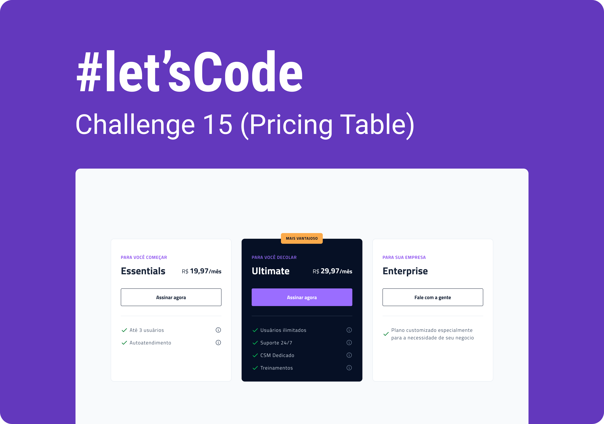

<h1 align="center"> Pricing Table </h1>

Page showing different plans and prices.  

  <a href="#-live-preview">Live Preview</a>&nbsp;&nbsp;&nbsp;|&nbsp;&nbsp;&nbsp;
  <a href="#-layout">Layout</a>&nbsp;&nbsp;&nbsp;|&nbsp;&nbsp;&nbsp;
  <a href="#-technologies">Technologies</a>&nbsp;&nbsp;&nbsp;|&nbsp;&nbsp;&nbsp;
  <a href="#-worked-on">Worked On</a>

 

  

 

## 📝 Live Preview 

- [Pricing Table](https://dmm.studio/github/rocketseat/events/zero-to-first-job-journey/horror-game-of-the-year)

 

  

 

## 🎨 Layout

- You can check the layout [here](https://www.figma.com/community/file/1227809985897425342/%23boracodar---Desafio-15). You will need a [Figma](https://figma.com) account to access it.

## 🧑🏻‍💻 Technologies

- HTML
- SCSS

## 🎓 Worked on

- CSS: `flex and grid`, `rem`, `background`