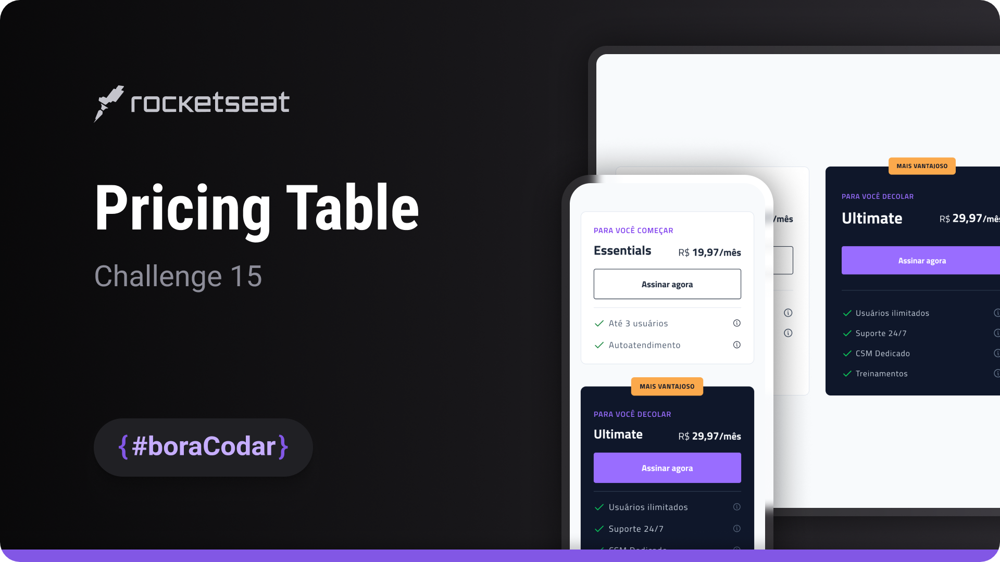

<h1 align="center">Pricing Table</h1>

A pricing table UI component designed to present digital product plans with clear hierarchy, comparison, and visual emphasis

  <a href="#live-preview">Live Preview</a>&nbsp;&nbsp;&nbsp;·&nbsp;&nbsp;&nbsp;
  <a href="#layout">Layout</a>&nbsp;&nbsp;&nbsp;·&nbsp;&nbsp;&nbsp;
  <a href="#technologies">Technologies</a>&nbsp;&nbsp;&nbsp;·&nbsp;&nbsp;&nbsp;
  <a href="#concepts-and-skills">Concepts and Skills</a>

 

  

 

<h3 id="live-preview">🌐 Live Preview</h3>

Access the deployed version of the project.

[Pricing Table — Recreated Version](https://diegommagno.com/github/rocketseat/events/boracodar.dev/15-pricing-table)

 

  

 

<h3 id="layout">🎨 Layout</h3>

- View the original challenge layout on [Figma](https://www.figma.com/community/file/1227809985897425342/%23boracodar---Desafio-15).
  A Figma account is required to access the file.

 

<h3 id="technologies">⚙️ Technologies</h3>

- HTML5
- CSS3
- SCSS

 

<h3 id="concepts-and-skills">📚 Concepts and Skills</h3>

- Semantic HTML structure to organize pricing plans and feature lists  

- Layout composition using Flexbox to align pricing cards consistently  

- Visual hierarchy to emphasize featured plans and primary actions  

- Scalable spacing and typography using `rem` units  

- Background styling and contrast to differentiate pricing tiers  

- Reusable card-based component structure for pricing presentation  

- Responsive layout prepared for different screen sizes  

 

This project is part of the <a href="https://boracodar.dev">boracodar.dev</a> weekly challenges.
It focuses on building a reusable pricing table component with clear comparison and visual hierarchy using HTML and SCSS.

