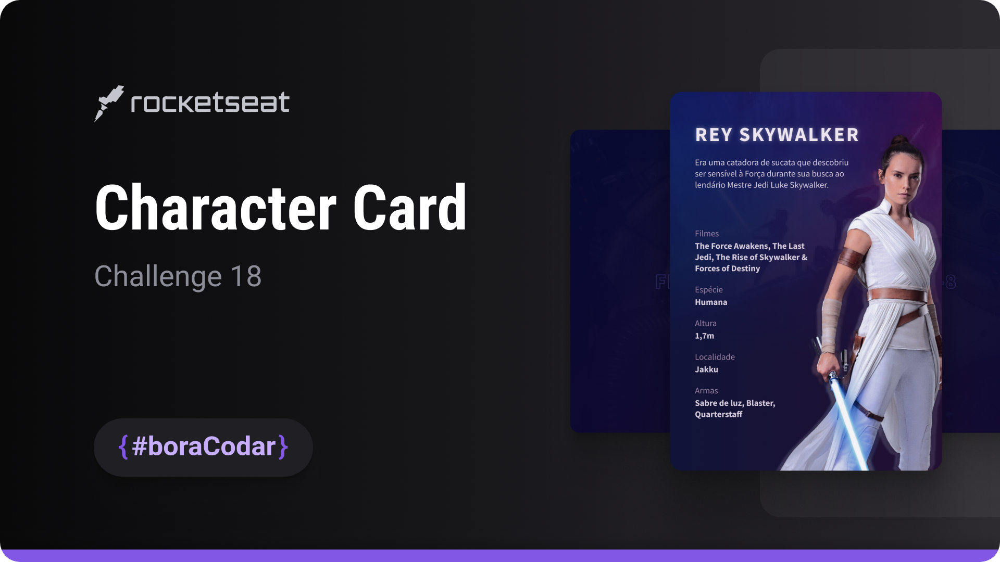

<h1 align="center">Character Card</h1>

A character card UI component featuring fictional data with a Star Wars–inspired theme, focused on layout structure and visual presentation

  <a href="#live-preview">Live Preview</a>&nbsp;&nbsp;&nbsp;·&nbsp;&nbsp;&nbsp;
  <a href="#layout">Layout</a>&nbsp;&nbsp;&nbsp;·&nbsp;&nbsp;&nbsp;
  <a href="#technologies">Technologies</a>&nbsp;&nbsp;&nbsp;·&nbsp;&nbsp;&nbsp;
  <a href="#concepts-and-skills">Concepts and Skills</a>

 

  

 

<h3 id="live-preview">🌐 Live Preview</h3>

Access the deployed version of the project.

[Character Card — Recreated Version](https://diegommagno.com/github/rocketseat/events/boracodar.dev/18-character-card)

 

<!-- 

  

 -->

 

<h3 id="layout">🎨 Layout</h3>

- View the original challenge layout [here](https://www.figma.com/community/file/1235589928611910732/%23boraCodar---Desafio-18).

 

<h3 id="technologies">⚙️ Technologies</h3>

- HTML5
- CSS3
- SCSS

 

<h3 id="concepts-and-skills">📚 Concepts and Skills</h3>

- Semantic HTML structure for card-based content presentation  

- Layout composition using Flexbox for alignment and spacing  

- Scalable spacing and typography using `rem` units  

- Use of CSS custom properties for consistent theming and color control  

- Visual hierarchy to emphasize character attributes and key information  

- Reusable card component structure prepared for extension  

- Responsive layout adjustments for different screen sizes  

 

This project is part of the <a href="https://boracodar.dev">boracodar.dev</a> weekly challenges.
It focuses on building a themed character card UI with attention to layout, hierarchy, and visual consistency using HTML and SCSS.

