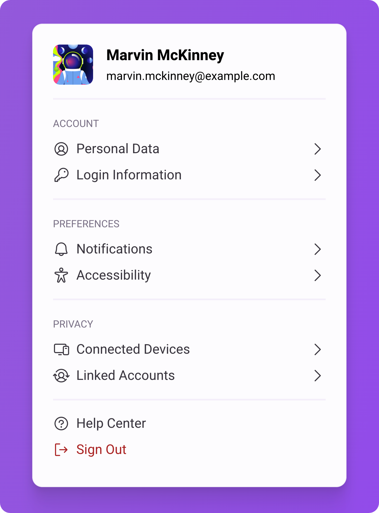

<h1 align="center">Profile Settings</h1>

A profile settings UI component designed for web and mobile interfaces with multilingual support and structured layout

  <a href="#live-preview">Live Preview</a>&nbsp;&nbsp;&nbsp;·&nbsp;&nbsp;&nbsp;
  <a href="#layout">Layout</a>&nbsp;&nbsp;&nbsp;·&nbsp;&nbsp;&nbsp;
  <a href="#technologies">Technologies</a>&nbsp;&nbsp;&nbsp;·&nbsp;&nbsp;&nbsp;
  <a href="#concepts-and-skills">Concepts and Skills</a>

 

  

 

<h3 id="live-preview">🌐 Live Preview</h3>

Access the deployed versions of the project.

- [Profile Settings — English](https://diegommagno.com/github/rocketseat/events/boracodar.dev/22-profile-settings/assets/locales/en.html)
- [Profile Settings — French](https://diegommagno.com/github/rocketseat/events/boracodar.dev/22-profile-settings/assets/locales/fr.html)
- [Profile Settings — Portuguese (BR)](https://diegommagno.com/github/rocketseat/events/boracodar.dev/22-profile-settings/)

 

  

 

<h3 id="layout">🎨 Layout</h3>

- View the original challenge layout on [Figma](https://www.figma.com/community/file/1245736372337157133).
  A Figma account is required to access the file.

 

<h3 id="technologies">⚙️ Technologies</h3>

- HTML5
- CSS3
- SCSS

 

<h3 id="concepts-and-skills">📚 Concepts and Skills</h3>

- Semantic HTML structure for account settings and profile-related sections  

- Multilingual project structure using separate localized HTML files  

- Layout composition using Flexbox and CSS Grid for consistent alignment  

- Scalable spacing and typography using `rem` units  

- Reusable UI component structure designed for web and mobile contexts  

- Visual consistency across different language versions  

 

This project is part of the <a href="https://boracodar.dev">boracodar.dev</a> weekly challenges.
It focuses on building a multilingual profile settings UI with clear structure and reusable layout patterns using HTML and SCSS.

