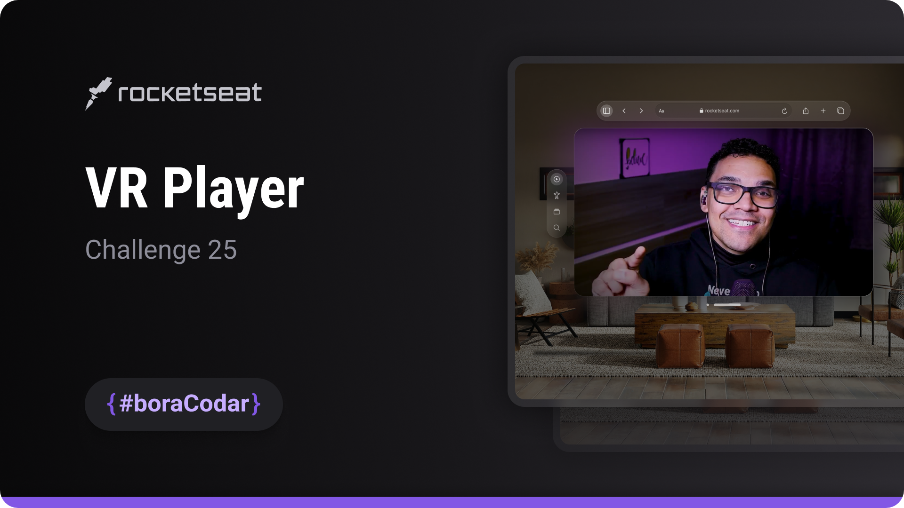

<h1 align="center">VR Player</h1>

A virtual reality video player UI concept focused on immersive visual design, layout composition, and modern interface aesthetics

  <a href="#live-preview">Live Preview</a>&nbsp;&nbsp;&nbsp;·&nbsp;&nbsp;&nbsp;
  <a href="#layout">Layout</a>&nbsp;&nbsp;&nbsp;·&nbsp;&nbsp;&nbsp;
  <a href="#technologies">Technologies</a>&nbsp;&nbsp;&nbsp;·&nbsp;&nbsp;&nbsp;
  <a href="#concepts-and-skills">Concepts and Skills</a>

 

  

 

<h3 id="live-preview">🌐 Live Preview</h3>

Access the deployed version of the project.

[VR Player — Recreated Version](https://diegommagno.com/github/rocketseat/events/boracodar.dev/25-vr-player/)

 

  

 

<h3 id="layout">🎨 Layout</h3>

- View the original challenge layout [here](https://www.figma.com/community/file/1253345035290143826).

 

<h3 id="technologies">⚙️ Technologies</h3>

- HTML5
- CSS3
- SCSS

 

<h3 id="concepts-and-skills">📚 Concepts and Skills</h3>

- Semantic HTML structure to organize video controls and immersive UI sections  

- Layout composition using Flexbox for alignment and spacing  

- Scalable spacing and typography using `rem` units  

- Glassmorphism-inspired visual styling to enhance depth and immersion  

- Layered interface design with visual focus on media content  

- UI structure prepared for future interactive enhancements  

 

This project is part of the <a href="https://boracodar.dev">boracodar.dev</a> weekly challenges.
It focuses on designing a visually immersive VR player interface using HTML and SCSS.

