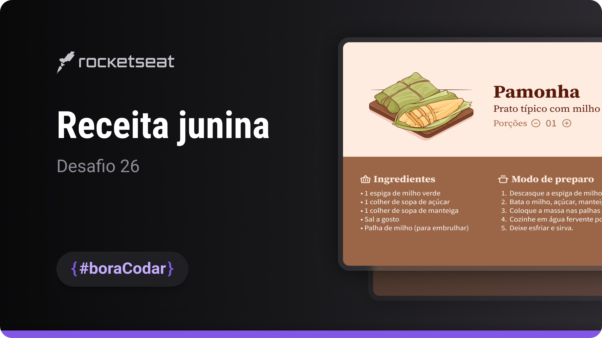
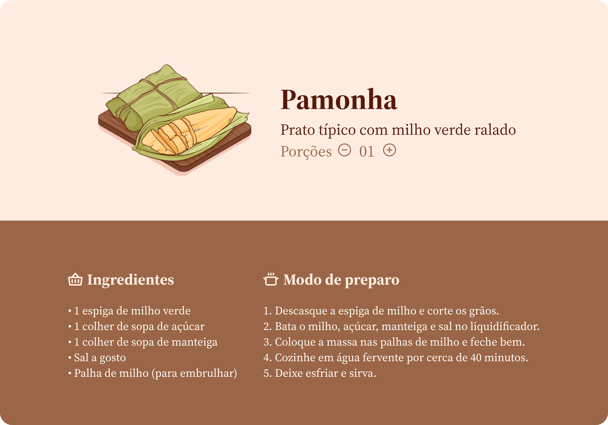

<h1 align="center">Receita Junina</h1>

A festive recipe landing page inspired by traditional Brazilian Festa Junina celebrations, focused on content layout and visual presentation

  <a href="#live-preview">Live Preview</a>&nbsp;&nbsp;&nbsp;·&nbsp;&nbsp;&nbsp;
  <a href="#layout">Layout</a>&nbsp;&nbsp;&nbsp;·&nbsp;&nbsp;&nbsp;
  <a href="#technologies">Technologies</a>&nbsp;&nbsp;&nbsp;·&nbsp;&nbsp;&nbsp;
  <a href="#concepts-and-skills">Concepts and Skills</a>

 

  

 

<h3 id="live-preview">🌐 Live Preview</h3>

Access the deployed version of the project.

[Receita Junina — Recreated Version](https://diegommagno.com/github/rocketseat/events/boracodar.dev/26-receita-junina/)

 

  

 

<h3 id="layout">🎨 Layout</h3>

- View the original challenge layout [here](https://www.figma.com/community/file/1255887923488942888).

 

<h3 id="technologies">⚙️ Technologies</h3>

- HTML5
- CSS3
- SCSS

 

<h3 id="concepts-and-skills">📚 Concepts and Skills</h3>

- Semantic HTML structure to organize recipe content, ingredients, and preparation steps  

- Layout composition using Flexbox for vertical flow and alignment  

- Scalable spacing and typography using `rem` units  

- Visual hierarchy to highlight titles, sections, and key information  

- Themed UI styling inspired by traditional Festa Junina aesthetics  

- Responsive layout prepared for different screen sizes  

 

This project is part of the <a href="https://boracodar.dev">boracodar.dev</a> weekly challenges.
It focuses on building a themed recipe landing page with clear content structure and visual identity using HTML and SCSS.

