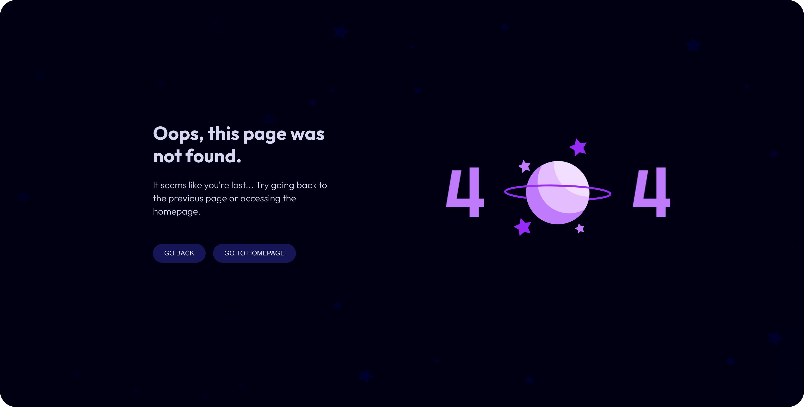

<h1 align="center"> 404 - Page Not Found </h1>

  The project is about developing a 404 error web page with animation.

  <a href="#-live-preview">Live Preview</a>&nbsp;&nbsp;&nbsp;|&nbsp;&nbsp;&nbsp;
  <a href="#-layout">Layout</a>&nbsp;&nbsp;&nbsp;|&nbsp;&nbsp;&nbsp;
  <a href="#-technologies">Technologies</a>&nbsp;&nbsp;&nbsp;|&nbsp;&nbsp;&nbsp;
  <a href="#-worked-on">Worked On</a>

 

  

 

## 📝 Live Preview 

- [404 - Page not found](https://dmm.studio/github/rocketseat/events/boracodar.dev/27-404-page-not-found/)

 

  

 

## 🎨 Layout

- You can check the layout [here](https://www.figma.com/community/file/1258418121860696031). You will need a [Figma](https://figma.com) account to access it.

## 🧑🏻‍💻 Technologies

- HTML
- SCSS

## 🎓 Worked on

- CSS: `flex`, `grid`, `rem`
