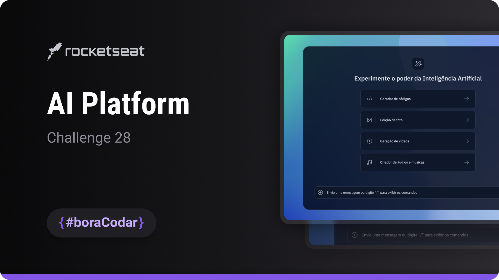
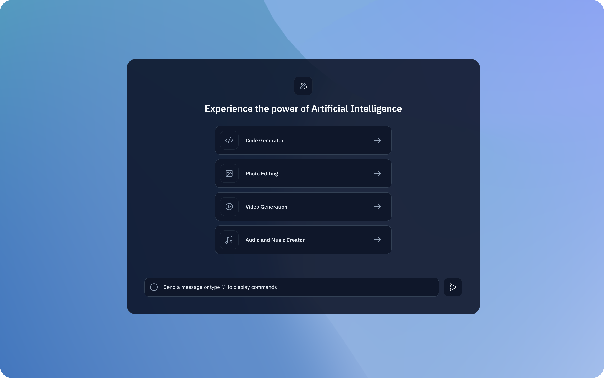

<h1 align="center">AI Platform</h1>

A landing page UI concept for an artificial intelligence platform, focused on visual hierarchy, layout composition, and modern interface aesthetics

  <a href="#live-preview">Live Preview</a>&nbsp;&nbsp;&nbsp;·&nbsp;&nbsp;&nbsp;
  <a href="#layout">Layout</a>&nbsp;&nbsp;&nbsp;·&nbsp;&nbsp;&nbsp;
  <a href="#technologies">Technologies</a>&nbsp;&nbsp;&nbsp;·&nbsp;&nbsp;&nbsp;
  <a href="#concepts-and-skills">Concepts and Skills</a>

 

  

 

<h3 id="live-preview">🌐 Live Preview</h3>

Access the deployed version of the project.

[AI Platform — Recreated Version](https://diegommagno.com/github/rocketseat/events/boracodar.dev/28-ai-platform)

 

  

 

<h3 id="layout">🎨 Layout</h3>

- View the original challenge layout [here](https://www.figma.com/community/file/1260950780300628490).

 

<h3 id="technologies">⚙️ Technologies</h3>

- HTML5
- CSS3
- SCSS

 

<h3 id="concepts-and-skills">📚 Concepts and Skills</h3>

- Semantic HTML structure for a marketing-focused landing page  

- Layout composition using Flexbox and CSS Grid for section alignment  

- Scalable spacing and typography using `rem` units  

- Use of CSS custom properties for consistent theming and color management  

- Cursor styling and visual affordances to enhance user interaction  

- Visual hierarchy to guide attention through headline, features, and call-to-action sections  

- Responsive layout prepared for different screen sizes  

 

This project is part of the <a href="https://boracodar.dev">boracodar.dev</a> weekly challenges.
It focuses on designing a modern AI platform landing page with strong visual structure and clean UI composition using HTML and SCSS.

