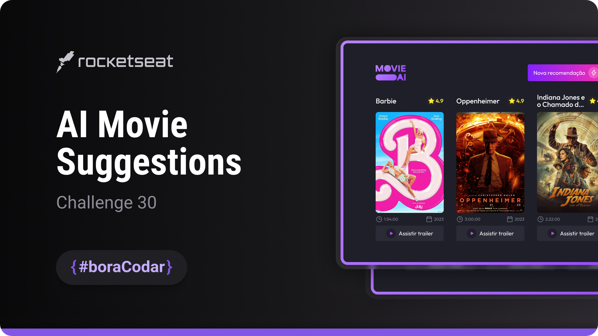
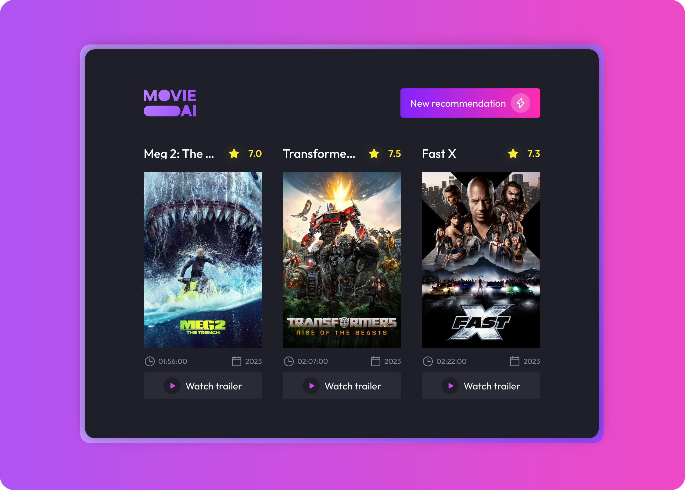

<h1 align="center">AI Movie Suggestions</h1>

  The task is to build an AI-powered movie recommendation generator.

  <a href="#-live-preview">Live Preview</a>&nbsp;&nbsp;&nbsp;|&nbsp;&nbsp;&nbsp;
  <a href="#-layout">Layout</a>&nbsp;&nbsp;&nbsp;|&nbsp;&nbsp;&nbsp;
  <a href="#-technologies">Technologies</a>&nbsp;&nbsp;&nbsp;|&nbsp;&nbsp;&nbsp;
  <a href="#-worked-on">Worked On</a>

 

  

 

## 📝 Live Preview 

- [AI Movie Suggestions - PT/BR](https://dmm.studio/github/rocketseat/events/boracodar.dev/30-ai-movie-suggestions)
- [AI Movie Suggestions - EN](https://dmm.studio/github/rocketseat/events/boracodar.dev/30-ai-movie-suggestions/projects/en/)

 

  

 

## 🎨 Layout

- You can check the layout [here](https://www.figma.com/community/file/1266028958590001589). You will need a [Figma](https://figma.com) account to access it.

## 🧑🏻‍💻 Technologies

- HTML
- JavaScript
- SCSS
- API

## 🎓 Worked on

- CSS: `flex`, `grid`, `rem`, `variables`, `cursor`, `::before`, `> div`, `API Connection`, `Async`, `try/catch`, `map`
