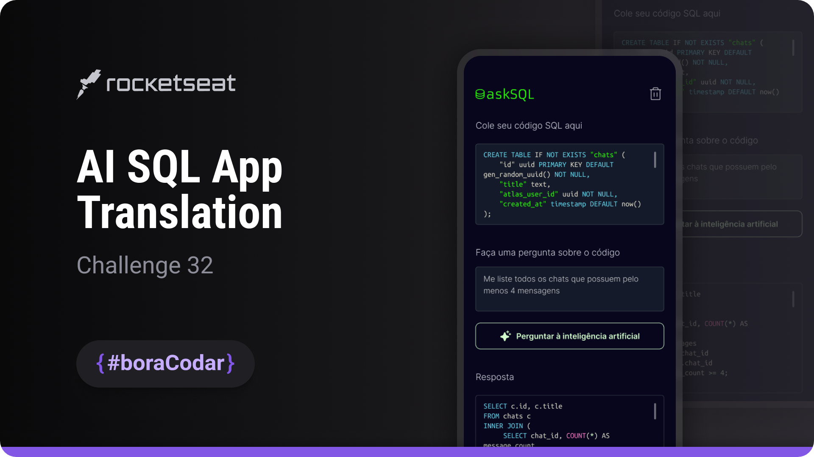

<h1 align="center">AI SQL App Translation</h1>

A landing page UI concept for an AI-powered SQL translation tool, focused on form layout, input handling, and visual clarity

  <a href="#live-preview">Live Preview</a>&nbsp;&nbsp;&nbsp;·&nbsp;&nbsp;&nbsp;
  <a href="#layout">Layout</a>&nbsp;&nbsp;&nbsp;·&nbsp;&nbsp;&nbsp;
  <a href="#technologies">Technologies</a>&nbsp;&nbsp;&nbsp;·&nbsp;&nbsp;&nbsp;
  <a href="#concepts-and-skills">Concepts and Skills</a>

 

  

 

<h3 id="live-preview">🌐 Live Preview</h3>

Access the deployed version of the project.

[AI SQL App Translation — Recreated Version](https://diegommagno.com/github/rocketseat/events/boracodar.dev/32-ai-sql-app-translation)

 

<!-- 

  

  -->

<h3 id="layout">🎨 Layout</h3>

- View the original challenge layout [here](https://www.figma.com/community/file/1271110680628406853).

 

<h3 id="technologies">⚙️ Technologies</h3>

- HTML5
- CSS3
- SCSS
- JavaScript (ES6+)

 

<h3 id="concepts-and-skills">📚 Concepts and Skills</h3>

- Semantic HTML structure for form-based user input and content sections  

- Layout composition using Flexbox for vertical alignment and spacing  

- Scalable spacing and typography using `rem` units  

- Custom form styling using CSS reset techniques such as `all: unset`  

- UI state toggling using JavaScript and conditional logic  

- Event handling with arrow functions and click-based interactions  

- Visual hierarchy to guide users through input, actions, and results areas  

- Responsive layout prepared for different screen sizes  

 

This project is part of the <a href="https://boracodar.dev">boracodar.dev</a> weekly challenges.
It focuses on designing a clean and modern landing page for an AI-based SQL translation concept using HTML, SCSS, and JavaScript.

