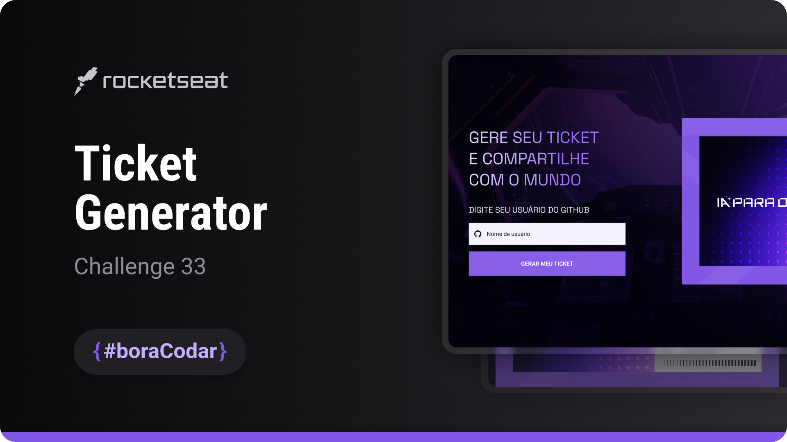

<h1 align="center"> Ticket Generator </h1>

  The challenge involves building a webpage that generates customized tickets based on a public GitHub profile.

  <a href="#-live-preview">Live Preview</a>&nbsp;&nbsp;&nbsp;|&nbsp;&nbsp;&nbsp;
  <a href="#-layout">Layout</a>&nbsp;&nbsp;&nbsp;|&nbsp;&nbsp;&nbsp;
  <a href="#-technologies">Technologies</a>&nbsp;&nbsp;&nbsp;|&nbsp;&nbsp;&nbsp;
  <a href="#-worked-on">Worked On</a>

 

  

 

## 📝 Live Preview 

- [Ticket Generator - PT/BR](https://dmm.studio/github/rocketseat/events/boracodar.dev/33-ticket-generator)
- [Ticket Generator - EN](http://127.0.0.1:5502/events/boracodar.dev/33-ticket-generator/projects/en/)

 

  

 

## 🎨 Layout

- You can check the layout [here](https://www.figma.com/community/file/1273622271836473382/Gerador-de-Ticket---Desafio-33). You will need a [Figma](https://figma.com) account to access it.

## 🧑🏻‍💻 Technologies

- HTML
- SCSS
- JavaScript

## 🎓 Worked on

- CSS: `flex`, `rem`, `ternary`, `toggle`, `form`, `all: unset;`, `> *`, `onclick`, `Arrow Function`
