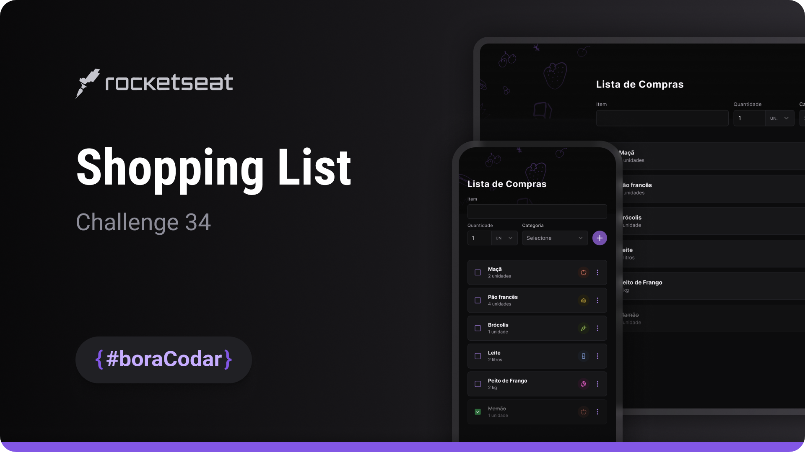

<h1 align="center">Shopping List</h1>

A base shopping list UI layout designed for a web and mobile checklist experience, prepared for future interaction and item management

  <a href="#live-preview">Live Preview</a>&nbsp;&nbsp;&nbsp;·&nbsp;&nbsp;&nbsp;
  <a href="#layout">Layout</a>&nbsp;&nbsp;&nbsp;·&nbsp;&nbsp;&nbsp;
  <a href="#technologies">Technologies</a>&nbsp;&nbsp;&nbsp;·&nbsp;&nbsp;&nbsp;
  <a href="#concepts-and-skills">Concepts and Skills</a>

 

  

 

<h3 id="live-preview">🌐 Live Preview</h3>

Access the deployed base version of the project.

[Shopping List — Recreated Version](https://diegommagno.com/github/rocketseat/events/boracodar.dev/34-shopping-list)

 

<!-- 

  

  -->

<h3 id="layout">🎨 Layout</h3>

- View the original challenge layout on [Figma](https://www.figma.com/community/file/1276169043084346929/Lista-de-Compras-%E2%80%A2-Desafio-34).
  A Figma account is required to access the file.

 

<h3 id="technologies">⚙️ Technologies</h3>

- HTML5
- CSS3
- SCSS
- JavaScript (ES6+)

 

<h3 id="concepts-and-skills">📚 Concepts and Skills</h3>

- Semantic HTML structure prepared to represent a checklist with items, actions, and input fields  

- Base layout composition focused on readability and mobile-first structure  

- Scalable spacing and typography using `rem` units  

- Custom form styling prepared for future interactive behavior  

- UI structure designed to support future state management (add, remove, and check items)  

 

This project is part of the <a href="https://boracodar.dev">boracodar.dev</a> weekly challenges.
It currently represents the base UI structure for a shopping list, prepared to receive logic and interaction in future iterations.

