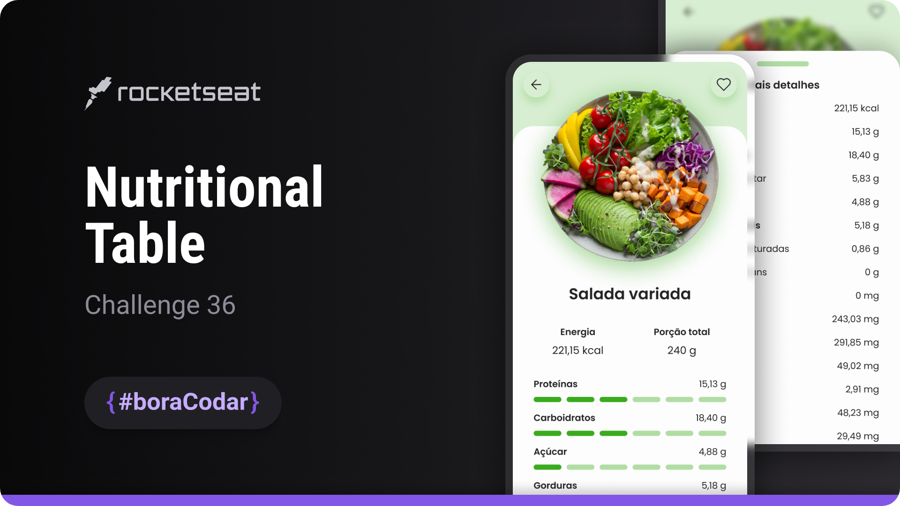

<h1 align="center">Nutritional Table</h1>

A mobile-focused interface designed to display structured nutritional information with clarity and visual hierarchy

  <a href="#live-preview">Live Preview</a>&nbsp;&nbsp;&nbsp;·&nbsp;&nbsp;&nbsp;
  <a href="#layout">Layout</a>&nbsp;&nbsp;&nbsp;·&nbsp;&nbsp;&nbsp;
  <a href="#technologies">Technologies</a>&nbsp;&nbsp;&nbsp;·&nbsp;&nbsp;&nbsp;
  <a href="#concepts-and-skills">Concepts and Skills</a>

 

  

 

<h3 id="live-preview">🌐 Live Preview</h3>

Access the deployed version of the project.

[Nutritional Table — Recreated Version](https://diegommagno.com/github/rocketseat/events/boracodar.dev/36-nutritional-table)

 

<!-- 

  

  -->

<h3 id="layout">🎨 Layout</h3>

- View the original challenge layout on [Figma](https://www.figma.com/community/file/1281253271689247675).
  A Figma account is required to access the file.

 

<h3 id="technologies">⚙️ Technologies</h3>

- HTML5
- CSS3
- SCSS

 

<h3 id="concepts-and-skills">📚 Concepts and Skills</h3>

- Base UI layout scaffolding for a mobile-first informational screen  

- Flexbox-based layout composition for vertical alignment and spacing  

- Scalable spacing and typography using `rem` units  

- Clear visual hierarchy for grouped nutritional data  

- Global CSS reset and consistent box model handling  

- Modular SCSS structure focused on readability and maintainability  

- Preparation for future dynamic behavior without JavaScript implementation  

 

This project is part of the <a href="https://boracodar.dev">boracodar.dev</a> weekly challenges.
It focuses on building a clean and structured UI foundation for presenting nutritional information on mobile devices.

