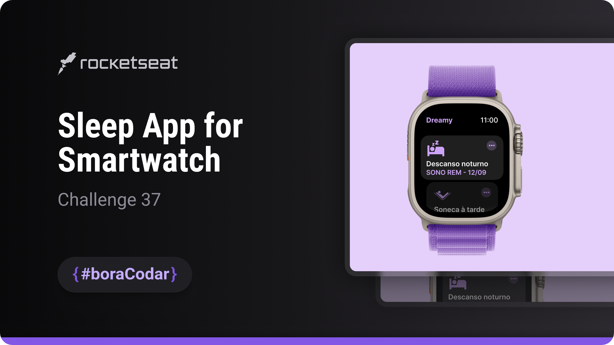
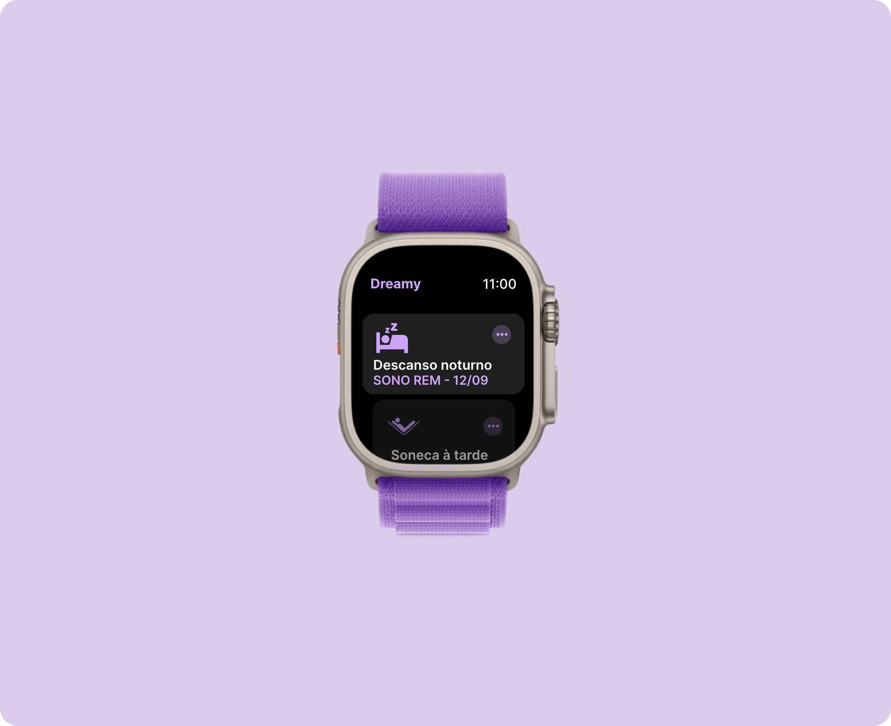

<h1 align="center">Sleep App for Apple Watch</h1>

A compact watch-style interface designed to display sleep history with clear visual hierarchy and minimal UI elements

  <a href="#live-preview">Live Preview</a>&nbsp;&nbsp;&nbsp;·&nbsp;&nbsp;&nbsp;
  <a href="#layout">Layout</a>&nbsp;&nbsp;&nbsp;·&nbsp;&nbsp;&nbsp;
  <a href="#technologies">Technologies</a>&nbsp;&nbsp;&nbsp;·&nbsp;&nbsp;&nbsp;
  <a href="#concepts-and-skills">Concepts and Skills</a>

 

  

 

<h3 id="live-preview">🌐 Live Preview</h3>

Access the deployed version of the project.

[Sleep App for Apple Watch — Recreated Version](https://diegommagno.com/github/rocketseat/events/boracodar.dev/37-sleep-app-for-apple-watch)

 

  

 

<h3 id="layout">🎨 Layout</h3>

- View the original challenge layout on [Figma](https://www.figma.com/community/file/1283783865388732530).
  A Figma account is required to access the file.

 

<h3 id="technologies">⚙️ Technologies</h3>

- HTML5
- CSS3
- SCSS

 

<h3 id="concepts-and-skills">📚 Concepts and Skills</h3>

- Base UI scaffolding for a smartwatch-sized interface  

- Flexbox-based layout composition for vertical stacking and alignment  

- Scalable spacing and typography using `rem` units  

- Element positioning and fine-tuned alignment using `transform: translate`  

- Visual differentiation through `nth-child` selectors  

- Content clipping and scroll control using `overflow`  

- Modular SCSS organization focused on compact UI readability  

- Preparation for future dynamic behavior without JavaScript implementation  

 

This project is part of the <a href="https://boracodar.dev">boracodar.dev</a> weekly challenges.
It focuses on building a precise and visually balanced UI foundation tailored for wearable device interfaces.

