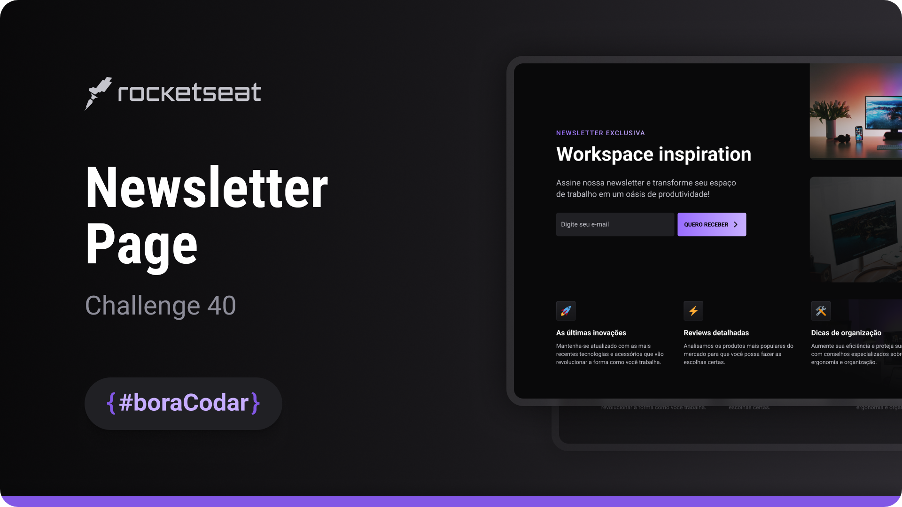

<h1 align="center">Newsletter Page</h1>

A newsletter subscription page designed to showcase computer setup inspiration through a clean and focused layout

  <a href="#live-preview">Live Preview</a>&nbsp;&nbsp;&nbsp;·&nbsp;&nbsp;&nbsp;
  <a href="#layout">Layout</a>&nbsp;&nbsp;&nbsp;·&nbsp;&nbsp;&nbsp;
  <a href="#technologies">Technologies</a>&nbsp;&nbsp;&nbsp;·&nbsp;&nbsp;&nbsp;
  <a href="#concepts-and-skills">Concepts and Skills</a>

 

  

 

<h3 id="live-preview">🌐 Live Preview</h3>

Access the deployed version of the project.

[Newsletter Page — Recreated Version](https://diegommagno.com/github/rocketseat/events/boracodar.dev/40-newsletter-page)

 

  

 

<h3 id="layout">🎨 Layout</h3>

- View the original challenge layout [here](https://www.figma.com/community/file/1291394985565910709).

 

<h3 id="technologies">⚙️ Technologies</h3>

- HTML5
- CSS3
- SCSS

 

<h3 id="concepts-and-skills">📚 Concepts and Skills</h3>

- UI recreation of a newsletter subscription page with emphasis on visual clarity  

- Flexbox-based layout composition for alignment and spacing  

- Scalable spacing and typography using `rem` units  

- Clear visual hierarchy for headline, supporting text, and form elements  

- Consistent box model handling and global CSS reset  

- Modular SCSS structure focused on layout and component organization  

- Preparation for future form interaction without JavaScript implementation  

 

This project is part of the <a href="https://boracodar.dev">boracodar.dev</a> weekly challenges.
It focuses on recreating a clean and visually engaging newsletter page using modern HTML and SCSS techniques.

