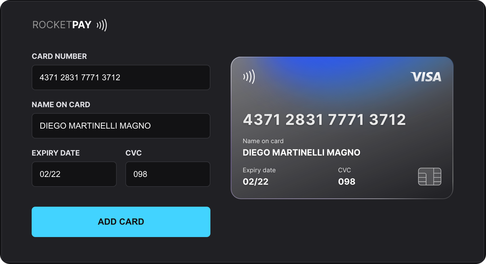

<h1 align="center"> RocketPay </h1>

  RocketPay is a component that simulates a credit card form, prepared to mask the inputs and update the HTML elements on the card via DOM.

  <a href="#-live-preview">Live Preview</a>&nbsp;&nbsp;&nbsp;|&nbsp;&nbsp;&nbsp;
  <a href="#-layout">Layout</a>&nbsp;&nbsp;&nbsp;|&nbsp;&nbsp;&nbsp;
  <a href="#-technologies">Technologies</a>&nbsp;&nbsp;&nbsp;|&nbsp;&nbsp;&nbsp;
  <a href="#-worked-on">Worked On</a>

 

  
  

 

## 📝 Live Preview 

- [RocketPay - PT/BR](https://explorer-lab-rocketpay-indol.vercel.app/) - [repo](https://github.com/diegommagno/explorer-lab-rocketpay)
- [RocketPay - EN](https://rocketpay-en.vercel.app/) - [repo](https://github.com/diegommagno/rocketpay-en)

## 🎨 Layout

- You can check the layout [here](https://www.figma.com/file/gpqavL469k0pPUGOmAQEM9/Explorer-Lab-%2301). You will need a [Figma](https://figma.com) account to access it.

## 🧑🏻‍💻 Technologies

- HTML e CSS
- JavaScript e JSON
- [Node e NPM](https://nodejs.org/)
- [Vite](https://vitejs.dev/)
- [iMask](https://imask.js.org)

## 🎓 Worked On

- Mobile first concept
- DOM elements
- How to apply iMask
- What is and how to use Regular Expressions (RegEx)

