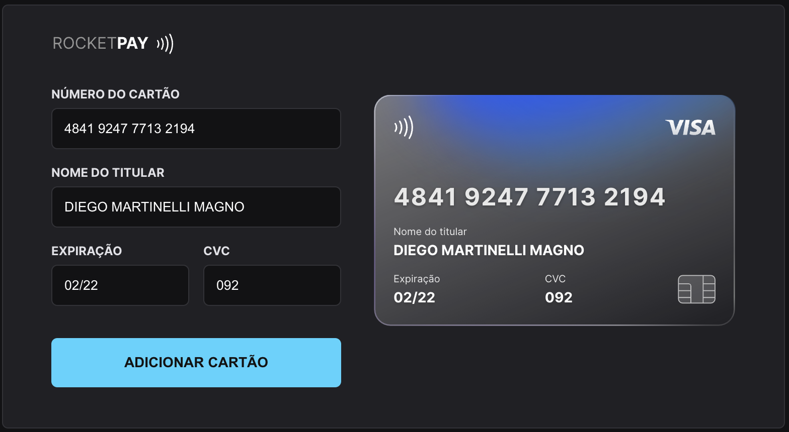

# RocketPay 💳

> RocketPay is a component that simulates a credit card form, prepared to mask the inputs and update the HTML elements on the card via DOM.

 

  
  

 

 

## 📝 Live Preview 

- [Brazilian Portuguese](https://explorer-lab-rocketpay-indol.vercel.app/) - [repo](https://github.com/diegommagno/explorer-lab-rocketpay)
- Update: [English](https://rocketpay-en.vercel.app/) - [repo](https://github.com/diegommagno/rocketpay-en)

## 🧑🏻‍💻 Technologies

- HTML e CSS
- JavaScript e JSON
- [Node e NPM](https://nodejs.org/)
- [Vite](https://vitejs.dev/)
- [iMask](https://imask.js.org)

## 🎓 Worked On

- Mobile first concept
- DOM elements
- How to apply iMask
- What is and how to use Regular Expressions (RegEx)

