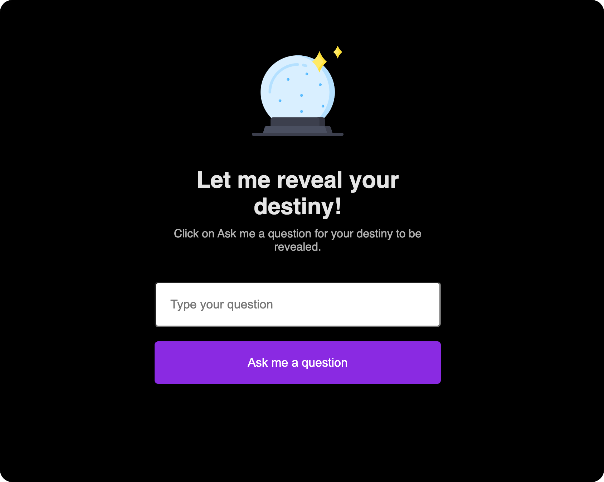

<h1 align="center"> Crystal Ball 🔮 </h1>

  Get your answers about the future! Just ask the crystal ball.

  <a href="#-live-preview">Live Preview</a>&nbsp;&nbsp;&nbsp;|&nbsp;&nbsp;&nbsp;
  <a href="#-technologies">Technologies</a>&nbsp;&nbsp;&nbsp;|&nbsp;&nbsp;&nbsp;
  <a href="#-worked-on">Worked On</a>

 

  

 

## 📝 Live Preview 

- [Crystal Ball - PT/BR](https://diegommagno.com/github/rocketseat/events/explorer-marathon/explorer-marathon-01/crystal-ball/pt-br/) - [repo](https://github.com/diegommagno/rocketseat/tree/main/events/explorer-marathon/explorer-marathon-01/crystal-ball/pt-br)
- [Crystal Ball - EN](https://diegommagno.com/github/rocketseat/events/explorer-marathon/explorer-marathon-01/crystal-ball/en/) - viewing now
- [Crystal Ball - EN - Wizarding World theme](https://diegommagno.com/github/rocketseat/events/explorer-marathon/explorer-marathon-01/wizarding-world-crystal-ball) - [repo](https://github.com/diegommagno/rocketseat/tree/main/events/explorer-marathon/explorer-marathon-01/wizarding-world-crystal-ball)

## 🧑🏻‍💻 Technologies

- HTML
- CSS
- JavaScript

## 🎓 Worked On

- CSS Cascade
- CSS Specificity
- Box Model
- Display block vs inline