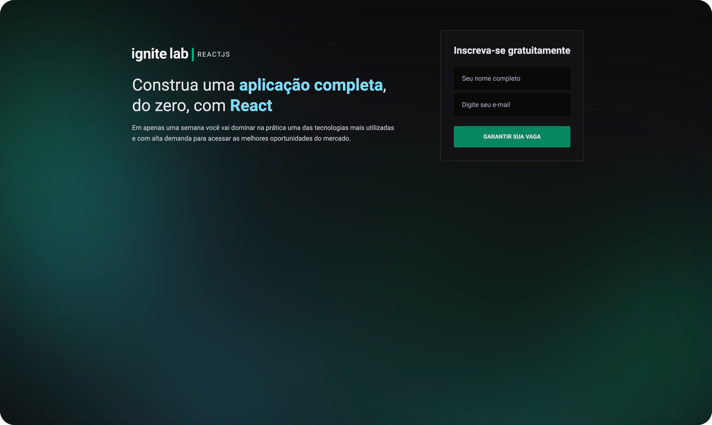
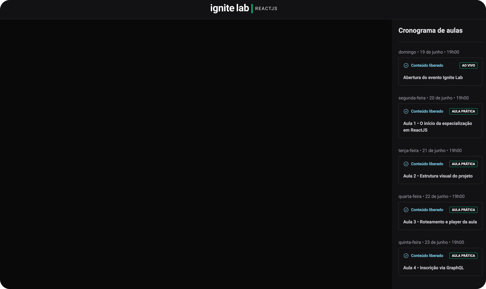

<h1 align="center"> Events Platform </h1>

  A user-friendly platform for hosting online events with scheduled or live-streamed videos. Simply enter your name and email address to log in and enjoy the content.

  <a href="#-live-preview">Live Preview</a>&nbsp;&nbsp;&nbsp;|&nbsp;&nbsp;&nbsp;
  <a href="#-layout">Layout</a>&nbsp;&nbsp;&nbsp;|&nbsp;&nbsp;&nbsp;
  <a href="#-technologies">Technologies</a>&nbsp;&nbsp;&nbsp;|&nbsp;&nbsp;&nbsp;
  <a href="#-worked-on">Worked On</a>

 

  
  

 

## 📝 Live Preview 

- [Events Platform - PT/BR](https://ignite-lab-umber-five.vercel.app/)
- The login can be made with any email to access the application.

## 🎨 Layout

- You can check the layout [here](https://www.figma.com/community/file/1120711251998877938). You will need a [Figma](https://figma.com) account to access it.

## 🧑🏻‍💻 Technologies

- GraphQL
- Apollo Client
- GraphQL Code Generator
- GraphCMS
- Vite
- Node.js
- React.js
- TypeScript
- Tailwind CSS

## 🎓 Worked On

- React.js 
- Node.js
- Vite
- GraphQL
- Tailwind CSS 
- Apollo GraphQL
- GraphCMS: how to use API data.
- TypeScript
