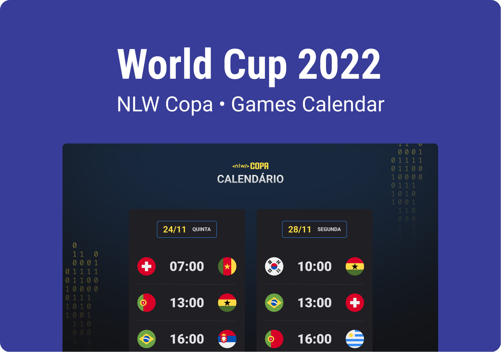

<h1 align="center"> NLW Copa Explorer </h1>

  Calendar showing the 2022 World Cup game dates. 

  <a href="#-live-preview">Live Preview</a>&nbsp;&nbsp;&nbsp;|&nbsp;&nbsp;&nbsp;
  <a href="#-layout">Layout</a>&nbsp;&nbsp;&nbsp;|&nbsp;&nbsp;&nbsp;
  <a href="#-technologies">Technologies</a>&nbsp;&nbsp;&nbsp;|&nbsp;&nbsp;&nbsp;
  <a href="#-worked-on">Worked On</a>

 

  

 

## 📝 Live Preview 

- [NLW Copa Explorer - PT/BR](https://dmm.studio/github/rocketseat/events/next-level-week/2022/nlw-copa/explorer/pt-br) - [repo](https://github.com/diegommagno/rocketseat/tree/main/events/next-level-week/2022/nlw-copa/explorer/pt-br)
- [NLW Copa Explorer - EN](https://dmm.studio/github/rocketseat/events/next-level-week/2022/nlw-copa/explorer/en) - [repo](https://github.com/diegommagno/rocketseat/tree/main/events/next-level-week/2022/nlw-copa/explorer/en)

## 🎨 Layout

- You can check the layout [here](https://www.figma.com/community/file/1169028052212317700). You will need a [Figma](https://figma.com) account to access it.

## 🧑🏻‍💻 Technologies

- HTML
- CSS
- JavaScript

## 🎓 Worked on

- Mobile first design
- Animations/Keyframes
- Clean code basics
- Adding HTML through JavaScript