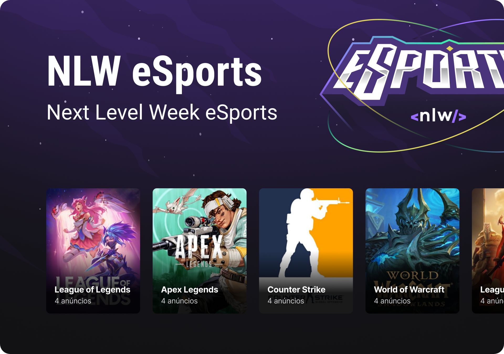
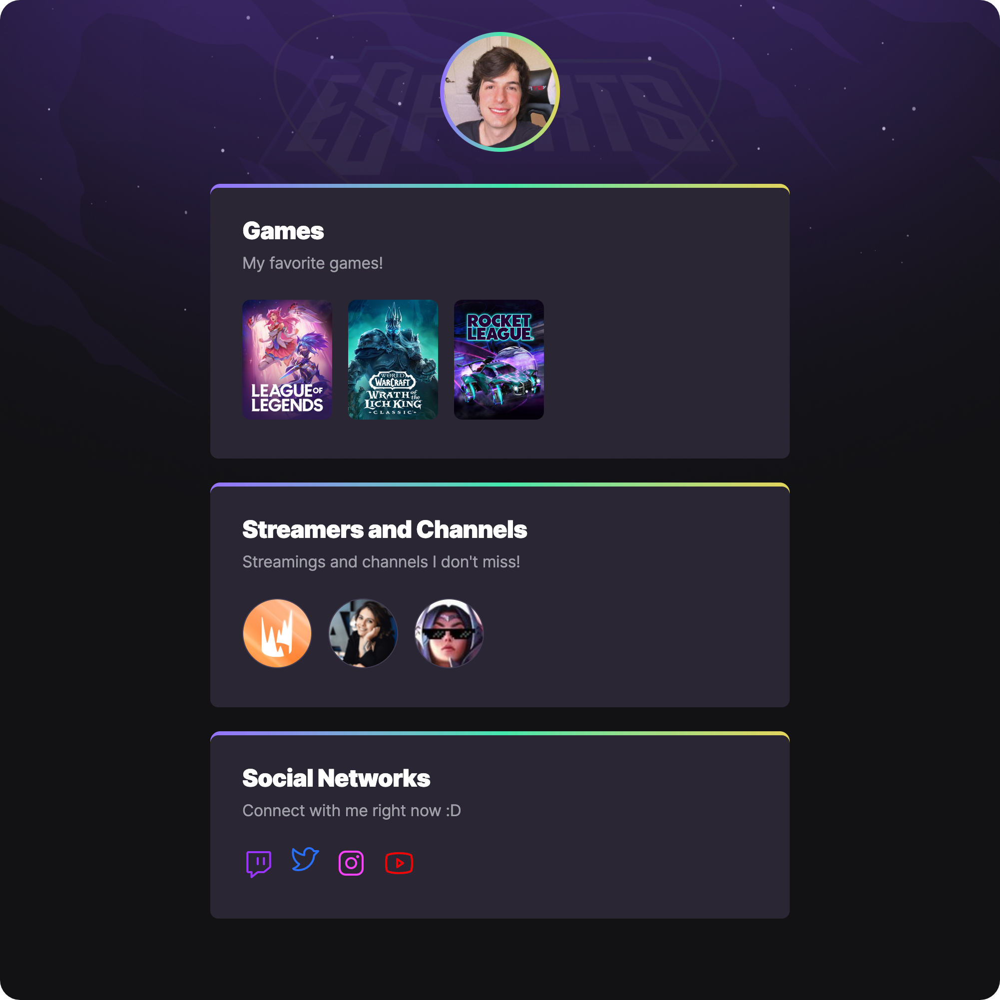

<h1 align="center"> NLW eSports Explorer </h1>

  Personal landing page showing your favorite games, channels, streamers and social networks.

  <a href="#-live-preview">Live Preview</a>&nbsp;&nbsp;&nbsp;|&nbsp;&nbsp;&nbsp;
  <a href="#-layout">Layout</a>&nbsp;&nbsp;&nbsp;|&nbsp;&nbsp;&nbsp;
  <a href="#-technologies">Technologies</a>&nbsp;&nbsp;&nbsp;|&nbsp;&nbsp;&nbsp;
  <a href="#-worked-on">Worked On</a>

 

  

 

## 📝 Live Preview 

- [NLW eSports Explorer - PT/BR](https://dmm.studio/github/rocketseat/events/next-level-week/2022/nlw-esports/explorer/pt-br) - [repo](https://github.com/diegommagno/rocketseat/tree/main/events/next-level-week/2022/nlw-esports/explorer/pt-br)
- [NLW eSports Explorer - EN](https://dmm.studio/github/rocketseat/events/next-level-week/2022/nlw-esports/explorer/en) - viewing now
- [NLW eSports Explorer - EN (Movies version)](https://dmm.studio/github/rocketseat/events/next-level-week/2022/nlw-esports/explorer/challenge/en) - [repo](https://github.com/diegommagno/rocketseat/tree/main/events/next-level-week/2022/nlw-esports/explorer/challenge/en)

  

## 🎨 Layout

- You can check the layout [here](https://www.figma.com/community/file/1150897317533332617/NLW-eSports). You will need a [Figma](https://figma.com) account to access it.

## 🧑🏻‍💻 Technologies

- HTML
- CSS

## 🎓 Worked on

- Creating personalised borders
- Using nth-child
- Animations/Keyframes