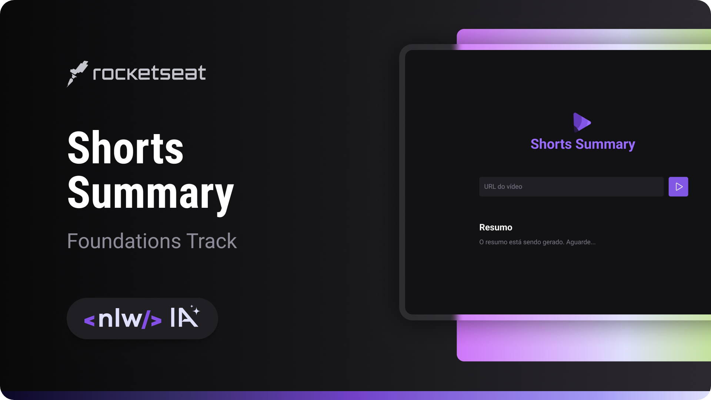
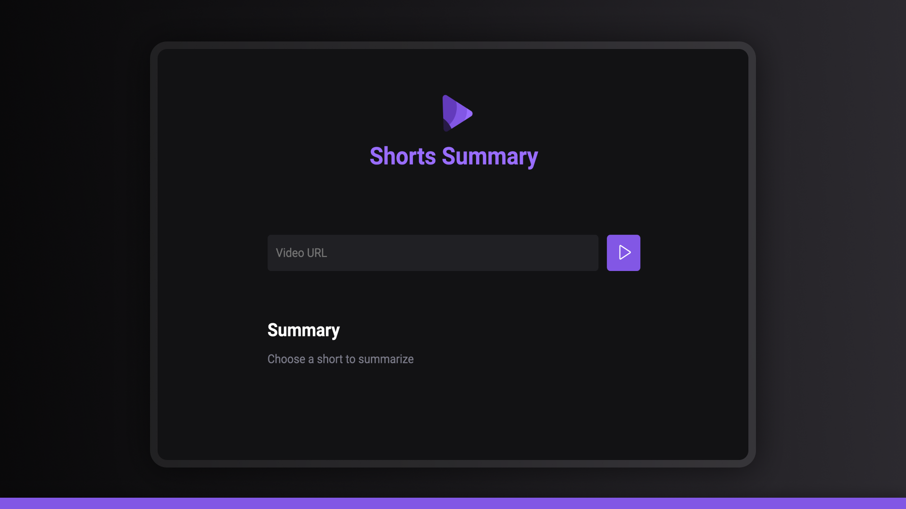

<h1 align="center">Shorts Summary</h1>

  "Shorts Summary" is a web application for creating summaries of YouTube short videos using Artificial Intelligence to transcribe the video's content and generate a summary. 

  <a href="#-live-preview">Live Preview</a>&nbsp;&nbsp;&nbsp;|&nbsp;&nbsp;&nbsp;
  <a href="#-layout">Layout</a>&nbsp;&nbsp;&nbsp;|&nbsp;&nbsp;&nbsp;
  <a href="#-technologies">Technologies</a>&nbsp;&nbsp;&nbsp;|&nbsp;&nbsp;&nbsp;
  <a href="#-worked-on">Worked On</a>

 

  

 

## 📝 Live Preview 

- [Shorts Summary](https://dmm.studio/github/rocketseat/events/next-level-week/2023/nlw-ai/explorer/foundations)

 

  

 

## 🎨 Layout

- You can check the layout [here](https://www.figma.com/community/file/1282823495335498952). You will need a [Figma](https://figma.com) account to access it.

## 🧑🏻‍💻 Technologies

- HTML
- SCSS
- JavaScript

## 🎓 Worked on

- CSS: `flex`, `rem`
