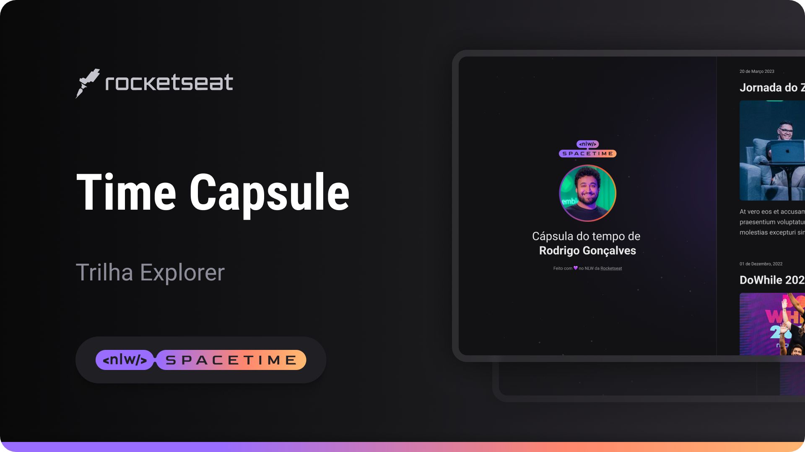
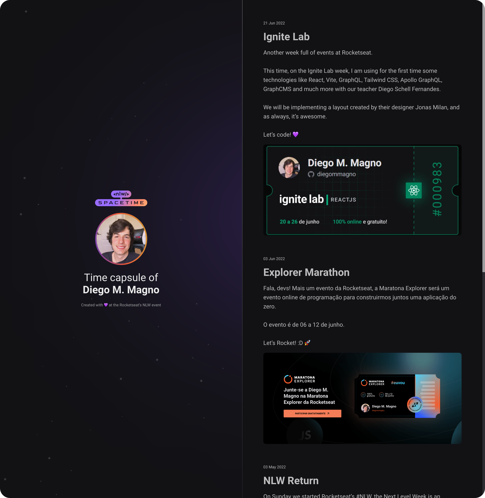

<h1 align="center">Spacetime</h1>

A digital time capsule interface that presents a personal timeline of moments and memories through a vertically scrollable layout

  <a href="#live-preview">Live Preview</a>&nbsp;&nbsp;&nbsp;·&nbsp;&nbsp;&nbsp;
  <a href="#layout">Layout</a>&nbsp;&nbsp;&nbsp;·&nbsp;&nbsp;&nbsp;
  <a href="#technologies">Technologies</a>&nbsp;&nbsp;&nbsp;·&nbsp;&nbsp;&nbsp;
  <a href="#concepts-and-skills">Concepts and Skills</a>

 

  

 

<h3 id="live-preview">🌐 Live Preview</h3>

Access the deployed version of the project.

[Spacetime](https://diegommagno.com/github/rocketseat/events/next-level-week/2023/nlw-spacetime/explorer/)

 

  

 

<h3 id="layout">🎨 Layout</h3>

- View the design layout [here](https://www.figma.com/community/file/1240071097028170811).

 

<h3 id="technologies">⚙️ Technologies</h3>

- HTML5  
- CSS3  
- SCSS  

 

<h3 id="concepts-and-skills">📚 Concepts and Skills</h3>

- Semantic HTML structure for timeline-based content  

- Two-column layout composition using Flexbox and CSS Grid  

- Vertical scrolling control with `overflow-y` handling  

- Fixed and sticky layout elements for persistent navigation  

- Responsive layout adjustments using media queries  

- Typography scaling and spacing with `rem` units  

- Use of CSS custom properties for colors and spacing  

- Entry and accent animations using `@keyframes`  

- Custom scrollbar styling with `::-webkit-scrollbar`  

- Visual separation of timeline items through spacing and borders  

 

This project focuses on building a visually rich and scroll-driven static interface using advanced CSS layout and animation techniques.

