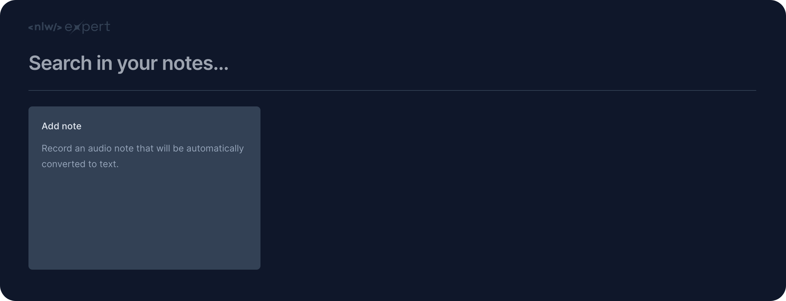
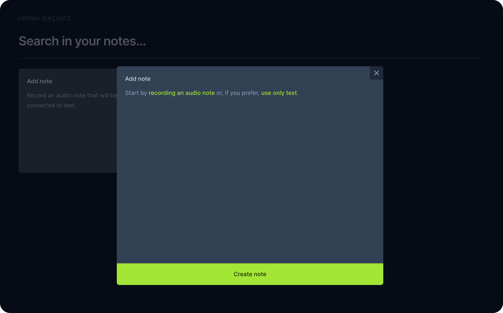
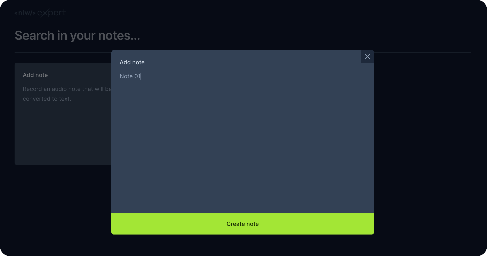
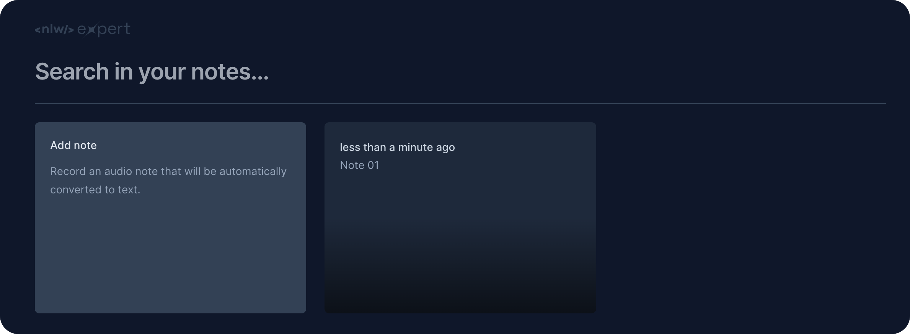

<h1 align="center">Expert Notes</h1>

A note-taking web application that allows users to create, search, and manage text or voice-based notes using a modern React stack

  <a href="#live-preview">Live Preview</a>&nbsp;&nbsp;&nbsp;·&nbsp;&nbsp;&nbsp;
  <a href="#layout">Layout</a>&nbsp;&nbsp;&nbsp;·&nbsp;&nbsp;&nbsp;
  <a href="#technologies">Technologies</a>&nbsp;&nbsp;&nbsp;·&nbsp;&nbsp;&nbsp;
  <a href="#concepts-and-skills">Concepts and Skills</a>

 

  

 

<h3 id="live-preview">🌐 Live Preview</h3>

Access the deployed version of the project.

[Expert Notes](https://nlw-expert-notes-liard-xi.vercel.app/)

 

  
  
  
  

 

<h3 id="layout">🎨 Layout</h3>

- View the design layout [here](https://www.figma.com/community/file/1336456128647909148/nlw-expert-notes).

 

<h3 id="technologies">⚙️ Technologies</h3>

- React  
- TypeScript  
- Vite  
- Tailwind CSS  
- Radix UI  
- date-fns  
- Sonner  
- Web Speech API  

 

<h3 id="concepts-and-skills">📚 Concepts and Skills</h3>

- React functional components with typed props and state  

- State management using `useState` for notes, search input, and UI state  

- Persistent client-side storage using `localStorage`  

- Dynamic filtering of notes based on search queries  

- Component composition and reuse for note creation and display  

- Modal and dialog management using Radix UI  

- Date formatting and relative time display with `date-fns`  

- Voice-to-text note creation using the Web Speech API  

- Controlled form inputs and event handling  

- Conditional rendering based on application state  

- Utility-first styling and responsive layout with Tailwind CSS  

- Toast notifications for user feedback using Sonner  

 

This project demonstrates how to build a fully client-side React application focused on usability, state management, and modern UI patterns without relying on a backend service.

