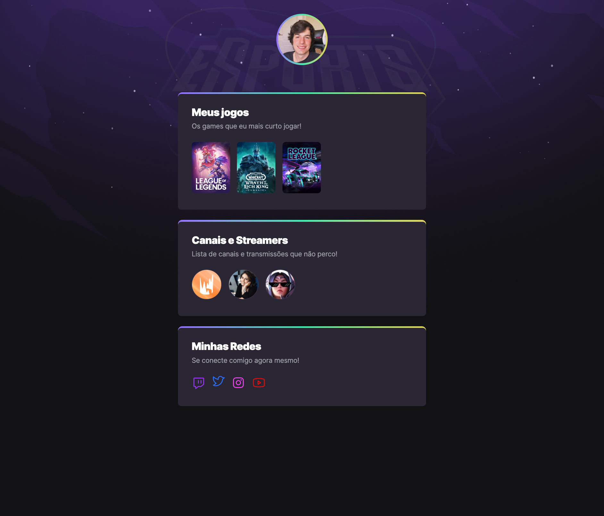

# NLW eSports Explorer

> Personal landing page for showing your favorite games, channels, streamers and social networks.
 

  

 

## 📝 Live Preview 

- [Brazilian Portuguese](https://diegommagno.com/github/rocketseat/explorer/stage-02/rocket-sect/pt-br/) - viewing now
- Update: [English](https://diegommagno.com/github/rocketseat/explorer/stage-02/rocket-sect/en) - [repo](https://github.com/diegommagno/rocketseat/tree/main/explorer/stage-02/rocket-sect/en/)

## 🧑🏻‍💻 Technologies

- HTML
- CSS

## 🎓 Worked on

- Creating personalised borders
- Using nth-child
- Animations/Keyframes