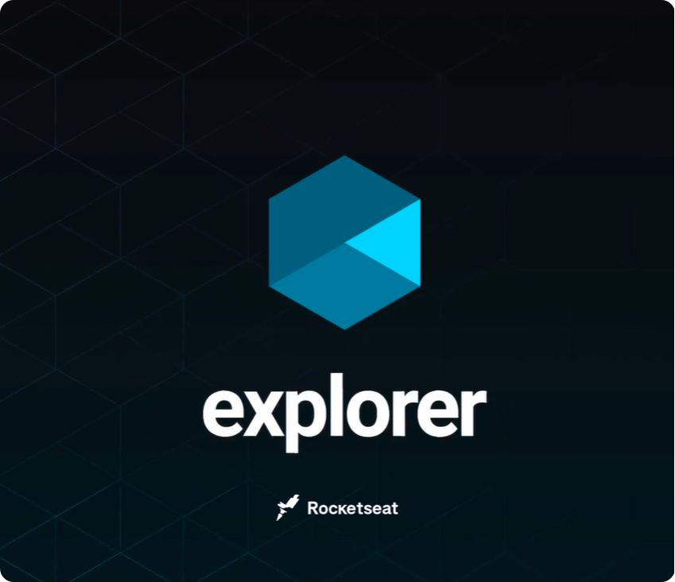

  

<h2 align="center">
  Explorer
</h2>

List showing the projects and challenges developed during the Explorer course.

### Stage 02

- [Project 01 - Furniture Store](https://github.com/diegommagno/rocketseat/tree/main/explorer/stage-02/furniture-store/pt-br)
- [Project 02 - Rocket.sect](https://github.com/diegommagno/rocketseat/tree/main/explorer/stage-02/rocket-sect/pt-br)
- [Project 03 - Train.me](https://github.com/diegommagno/rocketseat/tree/main/explorer/stage-02/train-me)

### Stage 03

- [Project 01 - Create Your Event Form](https://github.com/diegommagno/rocketseat/tree/main/explorer/stage-03/create-your-event-form)
- [Project 02 - Mentorship Form](https://github.com/diegommagno/rocketseat/tree/main/explorer/stage-03/mentorship-form)
- [Project 03 - Mentorship Feedback Form](https://github.com/diegommagno/rocketseat/tree/main/explorer/stage-03/mentorship-feedback-form)
- [Project 04 - Mobile first project](https://github.com/diegommagno/rocketseat/tree/main/explorer/stage-03/responsive)
- [Project 05 - Space Cream](https://github.com/diegommagno/rocketseat/tree/main/explorer/stage-03/advanced-css/space-cream)
- [Project 06 - Portfolio Cards](https://github.com/diegommagno/rocketseat/tree/main/explorer/stage-03/advanced-css/portfolio-cards)

### Stage 04

- [Project 01 - JavaScript Challenge 01](https://github.com/diegommagno/rocketseat/tree/main/explorer/stage-04)
- [Project 02 - JavaScript Challenge 02](https://github.com/diegommagno/rocketseat/tree/main/explorer/stage-04)

### Stage 05

- [Project 01 - Guessing Game](https://github.com/diegommagno/rocketseat/tree/main/explorer/stage-05/jogo-adivinhacao)
- [Project 02 - Calculate BMI](https://github.com/diegommagno/rocketseat/tree/main/explorer/stage-05/calcular-imc)
- [Project 03 - ES Modules](https://github.com/diegommagno/rocketseat/tree/main/explorer/stage-05/es-modules)
- [Project 04 - Calculate BMI (applying Modules)](https://github.com/diegommagno/rocketseat/tree/main/explorer/stage-05/calcular-imc/calcular-imc-modules)
- [Project 05 - FocusTimer](https://github.com/diegommagno/rocketseat/tree/main/explorer/stage-05/focustimer)
- [Project 06 - FocusTimer 2.0](https://github.com/diegommagno/rocketseat/tree/main/explorer/stage-05/focustimer-2.0)

### Stage 06

- [Project 01 - SPA Universe](https://github.com/diegommagno/rocketseat/tree/main/explorer/stage-05/jogo-adivinhacao)
- [Project 02 - GitFav](https://github.com/diegommagno/rocketseat/tree/main/explorer/stage-05/jogo-adivinhacao)

### Stage 08

- [Project 01 - SPA Universe](https://github.com/diegommagno/rocketseat/tree/main/explorer/stage-05/jogo-adivinhacao)
- [Project 02 - GitFav](https://github.com/diegommagno/rocketseat/tree/main/explorer/stage-05/jogo-adivinhacao)

### Stage 10

- [Project 01 - RocketMovies](https://github.com/diegommagno/rocketseat/tree/main/explorer/stage-05/jogo-adivinhacao)

### Bonus 

- [Bonus 01 - XX](link)

### Notes
Notes made on [Notion](link)
