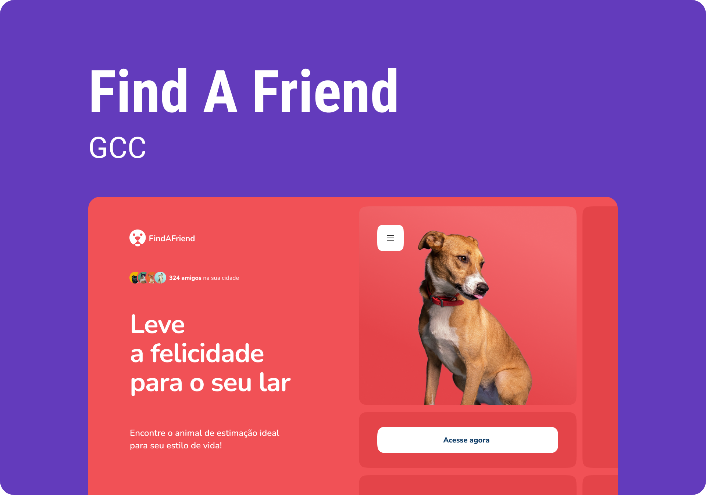

<h1 align="center"> Find a Friend </h1>

FindAFriend is a product developed by the Startup FindAFriend, where you can find the ideal pet for your life style! 🐶  

  <a href="#-live-preview">Live Preview</a>&nbsp;&nbsp;&nbsp;|&nbsp;&nbsp;&nbsp;
  <a href="#-layout">Layout</a>&nbsp;&nbsp;&nbsp;|&nbsp;&nbsp;&nbsp;
  <a href="#-technologies">Technologies</a>&nbsp;&nbsp;&nbsp;|&nbsp;&nbsp;&nbsp;
  <a href="#-worked-on">Worked On</a>

 

  

 

## 📝 Live Preview 

- [Find a Friend](https://diegommagno.com/rocketseat/explorer/events/green-chain-challenge/find-a-friend/)

 

  

 

## 🧑🏻‍💻 Technologies

- HTML
- SCSS
- JavaScript

## 🎓 Worked on

- CSS: `flex`, `rem`, `background`