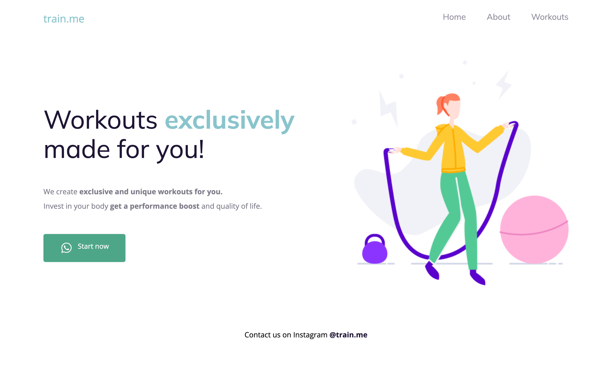

<h1 align="center"> Train me 🏃🏼‍♀️ </h1>

Landing page for a workouts website.  

  <a href="#-live-preview">Live Preview</a>&nbsp;&nbsp;&nbsp;|&nbsp;&nbsp;&nbsp;
  <a href="#-technologies">Technologies</a>&nbsp;&nbsp;&nbsp;|&nbsp;&nbsp;&nbsp;
  <a href="#-worked-on">Worked On</a>

 

  

 

## 📝 Live Preview 

- [Brazilian Portuguese](https://dmm.studio/github/rocketseat/explorer/stage-02/train-me/en/) - [repo](https://github.com/diegommagno/rocketseat/tree/main/explorer/stage-02/train-me/pt-br)
- Update: [English](https://dmm.studio/github/rocketseat/explorer/stage-02/train-me/en/) - viewing now

## 🧑🏻‍💻 Technologies

- HTML
- CSS

## 🎓 Worked on

- HTML tags
- Text and element alignment
- Changing fonts, colors
- CSS box model
- Flexbox
