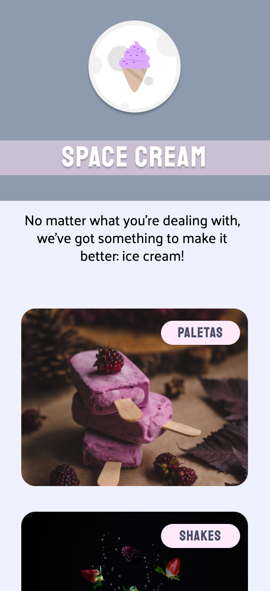

# Space Cream 🍦

> Making a mobile first website.

 

  

 

## 📝 Live Preview 

- [Brazilian Portuguese](https://diegommagno.com/github/rocketseat/explorer/stage-03/advanced-css/space-cream/pt-br/) - [repo](https://github.com/diegommagno/rocketseat/tree/main/explorer/stage-03/advanced-css/space-cream/pt-br/)
- Update: [English](https://diegommagno.com/github/rocketseat/explorer/stage-03/advanced-css/space-cream/en/) - [repo](https://github.com/diegommagno/rocketseat/tree/main/explorer/stage-03/advanced-css/space-cream/en/)

## 🧑🏻‍💻 Technologies

- HTML
- CSS

## 🎓 Worked On

- Mobile first concept
- Media queries
- CSS variables
- HSL colors
- Transitions and animations
- Flexible measurements