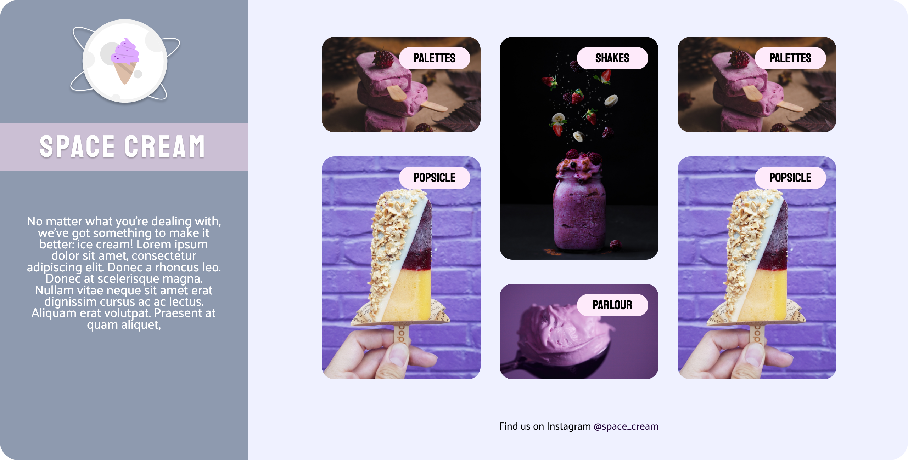

<h1 align="center"> Space Cream 🍦 </h1>

Making a mobile first website with desktop version.  

  <a href="#-live-preview">Live Preview</a>&nbsp;&nbsp;&nbsp;|&nbsp;&nbsp;&nbsp;
  <a href="#-technologies">Technologies</a>&nbsp;&nbsp;&nbsp;|&nbsp;&nbsp;&nbsp;
  <a href="#-worked-on">Worked On</a>

 

  

  

 

## 📝 Live Preview 

- [Default version](https://diegommagno.com/github/rocketseat/explorer/stage-03/advanced-css/space-cream/en/) - [repo](https://github.com/diegommagno/rocketseat/tree/main/explorer/stage-03/advanced-css/space-cream)
- Update: [Brazilian Portuguese](https://diegommagno.com/github/rocketseat/explorer/stage-03/advanced-css/space-cream/update/pt-br/) - viewing now
- Update: [English](https://diegommagno.com/github/rocketseat/explorer/stage-03/advanced-css/space-cream/update/en/) - [repo](https://github.com/diegommagno/rocketseat/tree/main/explorer/stage-03/advanced-css/space-cream/update/en/)

## 🧑🏻‍💻 Technologies

- HTML
- CSS

## 🎓 Worked On

- Mobile first concept
- Grid
- Media queries
- Keyframes
- CSS variables
- Transitions and animations
- Flexible measurements