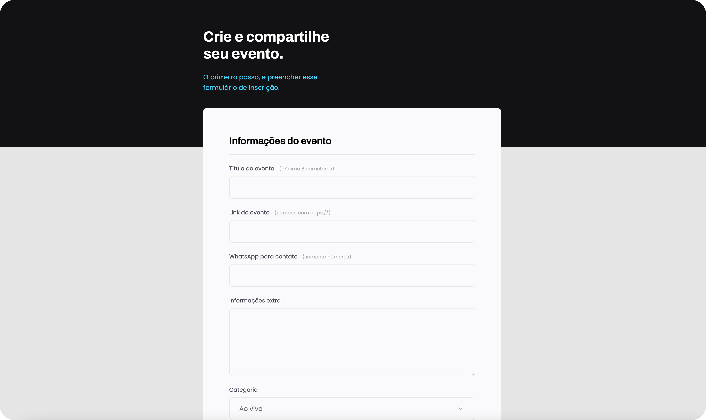

<h1 align="center"> Create your event </h1>

Form template for creating events.  

  <a href="#-live-preview">Live Preview</a>&nbsp;&nbsp;&nbsp;|&nbsp;&nbsp;&nbsp;
  <a href="#-technologies">Technologies</a>&nbsp;&nbsp;&nbsp;|&nbsp;&nbsp;&nbsp;
  <a href="#-worked-on">Worked On</a>

 

  

 

## 📝 Live Preview 

- [Brazilian Portuguese](https://diegommagno.com/github/rocketseat/explorer/stage-03/create-your-event-form/pt-br/) - viewing now
- Update: [English](https://diegommagno.com/github/rocketseat/explorer/stage-03/create-your-event-form/en/) - [repo](https://github.com/diegommagno/rocketseat/tree/main/explorer/stage-03/create-your-event-form/en)

## 🧑🏻‍💻 Technologies

- HTML
- CSS

## 🎓 Worked On

- How to create a personalised input without losing accessibility features
- Differences between GET, POST
- Using input, label, form, fieldset, select
- How to make fields required for submitting the form