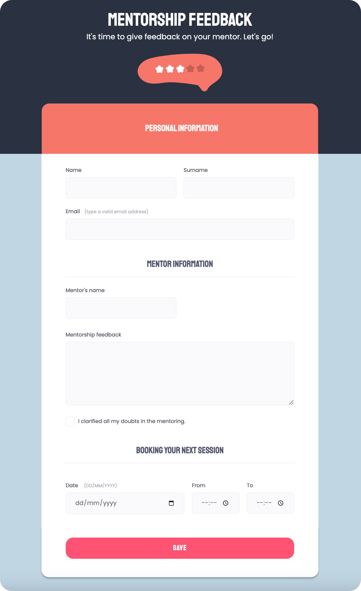

<h1 align="center"> Mentorship Feedback Form</h1>

Form template giving feedback on your mentorship.  

  <a href="#-live-preview">Live Preview</a>&nbsp;&nbsp;&nbsp;|&nbsp;&nbsp;&nbsp;
  <a href="#-layout">Layout</a>&nbsp;&nbsp;&nbsp;|&nbsp;&nbsp;&nbsp;
  <a href="#-technologies">Technologies</a>

 

  

 

## 📝 Live Preview 

- [Mentorship Feedback Form](https://dmm.studio/github/rocketseat/explorer/stage-03/mentorship-feedback-form/)

## 🎨 Layout

- [Figma Link](https://www.figma.com/file/fnZyJHs7eqNFAA7tUrKcsD/Stage-03---Formul%C3%A1rio-avan%C3%A7ado)

## 🧑🏻‍💻 Technologies

- HTML
- CSS