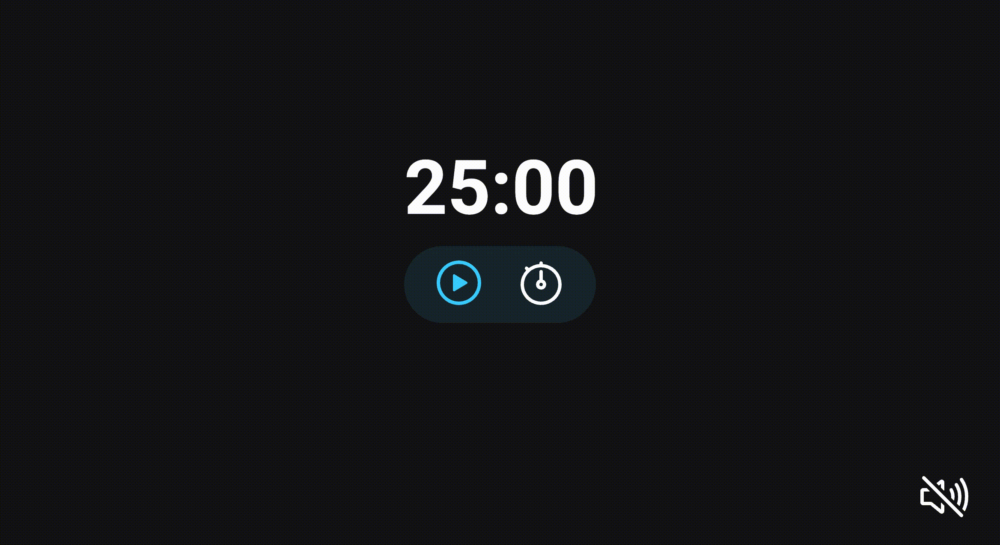

<h1 align="center"> FocusTimer </h1>

Cronometer made with HTML, CSS and JavaScript.  

  <a href="#-live-preview">Live Preview</a>&nbsp;&nbsp;&nbsp;|&nbsp;&nbsp;&nbsp;
  <a href="#-technologies">Technologies</a>&nbsp;&nbsp;&nbsp;|&nbsp;&nbsp;&nbsp;
  <a href="#-layout">Layout</a>&nbsp;&nbsp;&nbsp;|&nbsp;&nbsp;&nbsp;
  <a href="#-worked-on">Worked On</a>

  

  

 

## 📝 Live Preview 

- [FocusTimer](hhttps://diegommagno.com/github/rocketseat/explorer/stage-05/focustimer/)
- Update: [FocusTimer 2.0](https://diegommagno.com/github/rocketseat/explorer/stage-05/focustimer-2/) - [repo](https://github.com/diegommagno/rocketseat/tree/main/explorer/stage-05/focustimer-2.0)

## 🧑🏻‍💻 Technologies

- HTML
- CSS
- JavaScript

## 🎓 Worked on

- Grid, flex-box
- Clamp
- Toggle classes (hide)

## 🎓 Updated
- Added keydown support for controls
- Clamp
- CSS Grid
- Modules
- Function factory
- Object Destructuring
- Play sound on button click